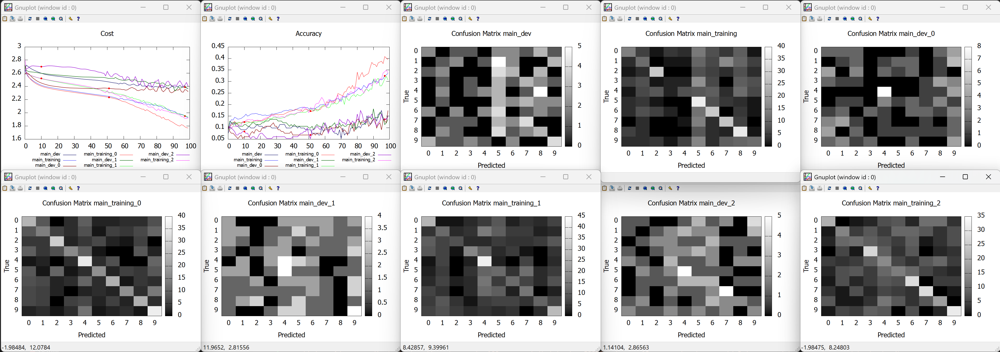
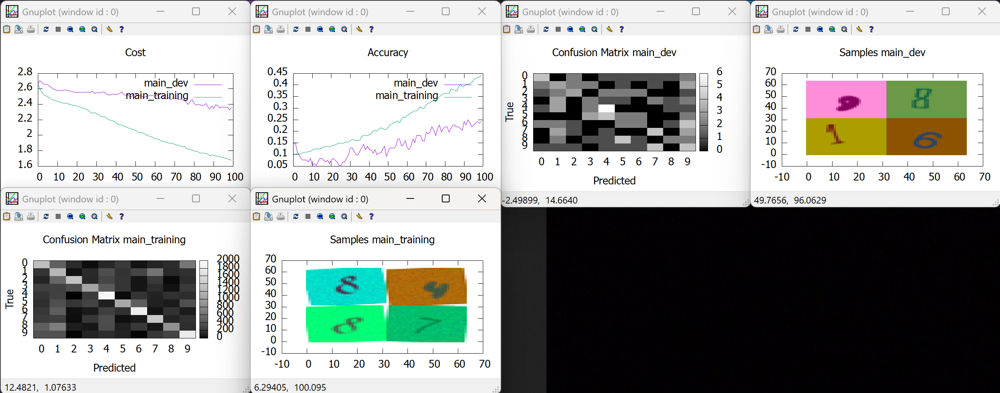

# Ruby Neural Nets

A Ruby playground for implementing, coding, benchmarking, and comparing neural network techniques and libraries. This project provides a framework for building and training neural networks from scratch using Numo (Ruby's numerical array library) and RMagick for image processing.

## Table of Contents

- [Features](#features)
- [Installation](#installation)
  - [Prerequisites](#prerequisites)
  - [Setup](#setup)
- [Usage](#usage)
  - [Running the Example](#running-the-example)
    - [Key Options Explained](#key-options-explained)
  - [Running Multiple Experiments](#running-multiple-experiments)
    - [Basic Multiple Experiments](#basic-multiple-experiments)
    - [Advanced Experiment Configuration](#advanced-experiment-configuration)
    - [Experiment Features](#experiment-features)
    - [Experiment Output](#experiment-output)
  - [Gradient Checking](#gradient-checking)
  - [Datasets](#datasets)
  - [Creating Custom Datasets](#creating-custom-datasets)
  - [Data Augmentation](#data-augmentation)
    - [Available Augmentation Layers](#available-augmentation-layers)
    - [Data Processing Pipeline](#data-processing-pipeline)
      - [Preprocessing Phase](#preprocessing-phase)
      - [Augmentation Phase](#augmentation-phase)
      - [Batching Phase](#batching-phase)
    - [Example Usage](#example-usage)
- [Code Structure](#code-structure)
- [Contributing](#contributing)
- [Findings and experiments](#findings-and-experiments)
  - [One layer model on colors dataset](#one-layer-model-on-colors-dataset)
  - [One layer model on numbers dataset](#one-layer-model-on-numbers-dataset)
  - [N layer model on colors dataset](#n-layer-model-on-colors-dataset)
  - [N layer model on numbers dataset](#n-layer-model-on-numbers-dataset)
    - [Observations without regularization](#observations-without-regularization)
    - [Effects of hyper parameters changes](#effects-of-hyper-parameters-changes)
      - [Data preparation hyper parameters](#data-preparation-hyper-parameters)
      - [Data stochastic augmentation hyper parameters](#data-stochastic-augmentation-hyper-parameters)
      - [Model hyper parameters](#model-hyper-parameters)
      - [Regularization hyper parameters](#regularization-hyper-parameters)
    - [Regularization](#regularization)
  - [N layer model using PyTorch](#n-layer-model-using-pytorch)
    - [Experiment [A]: Same parameters as with Numo implementation](#experiment-a-same-parameters-as-with-numo-implementation)
    - [Experiment [B]: Measuring model randomness effect](#experiment-b-measuring-model-randomness-effect)
    - [Experiment [C]: Measuring dataset randomness effect](#experiment-c-measuring-dataset-randomness-effect)
  - [Performance benchmarks](#performance-benchmarks)
    - [Ruby Numo](#ruby-numo)
    - [Torch.rb](#torchrb)
- [License](#license)

## Features

- **Experiment Management**: Run multiple experiments with different configurations in a single command, each with unique IDs and separate progress tracking
- **Layered Datasets**: Modular dataset processing framework with composable layers (partitioning, shuffling, caching, encoding, minibatching) enabling reusable features between Numo and PyTorch implementations
- **Data Augmentation**: Built-in data augmentation capabilities with Clone and modular image transformation layers for expanding datasets through duplication and various random transformations
- **TorchVision Integration**: TorchVision transforms for Ruby providing image preprocessing pipelines compatible with PyTorch workflows
- **Dataset Management**: Load and preprocess image datasets with support for training, development, and test splits using extensible data loader architecture
- **Neural Network Models**: Implement various neural network architectures (one-layer, multi-layer) with modular layers including Dense, Batch Normalization, Dropout, and activations (ReLU, Leaky ReLU, Sigmoid, Softmax, Tanh)
- **Training Framework**: Complete training loop with optimizers, loss functions, and accuracy metrics, featuring a simplified architecture with externalized GradientChecker, ProgressTracker, and Profiler components
- **Weight Decay (L2 Regularization)**: Built-in L2 regularization support across all optimizers to prevent overfitting and improve generalization
- **Gradient Checking**: Built-in gradient checking to verify analytical gradients against numerical approximations, configurable to run every n epochs
- **Profiling**: Optional epoch profiling with HTML reports generated using ruby-prof to analyze performance bottlenecks
- **OpenBLAS Linear Algebra**: Fast matrix operations powered by OpenBLAS through numo-linalg for improved computational performance
- **Visualization**: Confusion matrix plotting using Gnuplot, with real-time parameter visualization in progress tracker graphs
- **Named Parameters**: Parameters include names for better identification and visualization
- **Logger Mixin**: Unified logging system with ISO8601 UTC timestamps and class name prefixes, supporting both regular and debug (lazy-evaluated) logging across all major components
- **Extensible Architecture**: Modular design for easy addition of new models, optimizers, and loss functions
- **Early Stopping**: Automatic early stopping based on development set accuracy to prevent overfitting, with configurable patience and visual markers on training graphs

## Installation

### Prerequisites

1. **Ruby**: Ensure Ruby is installed on your system
2. **ImageMagick**: Download and install ImageMagick from [https://imagemagick.org/script/download.php](https://imagemagick.org/script/download.php)
   - Make sure to include DLL and C/C++ headers during installation
   - Use the Q16-x64-dll.exe version, not the HDRI or static version (details [https://github.com/rmagick/rmagick?tab=readme-ov-file#windows](here)).
3. **Bundler**: Install Bundler if not already available: `gem install bundler`
4. **libTorch**: Download the C++ library from [https://pytorch.org/get-started/locally/](https://pytorch.org/get-started/locally/), and configure bundler to use it: `bundle config set build.torch-rb --with-torch-dir=/path/to/libtorch-shared-with-deps-2.9.0+cu126/libtorch/`
5. **OpenBLAS** (optional): For improved matrix computation performance, install OpenBLAS and set the `OPEN_BLAS_PATH` environment variable to the path containing the OpenBLAS library files (e.g., `OPEN_BLAS_PATH=/path/to/openblas/lib`). If not set, the framework will run without OpenBLAS acceleration.

### Setup

1. Clone this repository
2. Navigate to the project directory
3. Install dependencies:
   ```bash
   bundle install
   ```

## Usage

### Running the Example

The `run` tool provides a comprehensive CLI interface for configuring and running neural network training experiments. Use `bundle exec ruby bin/run --help` to see all available options.

Run the following command to see a complete example of training a neural network on the numbers dataset:

```bash
bundle exec ruby bin/run --dataset=numbers
```

This runs with default settings:
- **Dataset**: Handwritten digits (0-9) from the numbers dataset
- **Model**: OneLayer (simple softmax classification)
- **Optimizer**: Adam with learning rate 0.001
- **Training**: 100 epochs, full batch (no minibatches)
- **Accuracy**: ClassesNumo (standard accuracy measurement)
- **Loss**: CrossEntropy
- **Checks**: Gradient checking enabled (exceptions on failure), instability checks via byebug

#### Key Options Explained

- **`--dataset`**: Choose dataset (colors, numbers)
  - Controls which dataset to load and train on

- **`--model`**: Select neural network architecture (OneLayer, NLayers, etc.)
  - Controls the model type and layer configuration
  - Use `--layers` to specify hidden layer sizes (comma-separated integers)

- **`--optimizer`**: Choose optimization algorithm (Adam, Constant, ExponentialDecay, etc.)
  - Controls how model parameters are updated during training
  - Use `--learning-rate` to set learning rate, `--decay` for decay-based optimizers, `--weight-decay` for L2 regularization (default: 0.0)

- **`--data-loader`**: Select data loading method (NumoImageMagick, NumoVips, TorchVips, TorchImageMagick)
  - Controls the dataset processing pipeline (partitioning, shuffling, caching, encoding, minibatching)

- **`--loss`**: Choose loss function (CrossEntropy, CrossEntropyTorch)
  - Defines the training objective function

- **`--accuracy`**: Choose accuracy metric (ClassesNumo, ClassesTorch)
  - Defines how predictions are evaluated

- **`--nbr-epochs`**: Number of training iterations (default: 100)
- **`--max-minibatch-size`**: Mini-batch size for memory-limited training (default: 5000, full batch)
- **`--gradient-checks`**: Enable/disable automatic gradient verification (byebug/exception/off/warning)
- **`--instability-checks`**: Enable/disable numerical instability monitoring (same options)
- **`--profiling`**: Enable performance profiling with HTML reports (boolean, default: false)
- **`--debug`**: Enable debug mode for verbose logging output (boolean, default: false)
  - When enabled, shows detailed debug messages from model forward/backward propagation and other internal operations
  - Debug messages use lazy evaluation to avoid performance overhead when disabled
- **`--display-graphs`**: Display GnuPlot graphs during training (boolean, default: true)
  - Controls whether to show real-time visualization of training progress, cost, accuracy, and parameter evolution
  - When disabled, training runs faster without graphical output
  - Useful for headless environments or when visualization is not needed
- **`--early-stopping-patience`**: Number of epochs to wait for development set loss improvement before stopping training (integer, default: 10)
  - Monitors development set loss (including L2 regularization) and notifies when no improvement occurs for the specified number of epochs
  - Training continues, but a red circle marker is placed on the graphs at the early stopping epoch
  - Use `--eval-dev` to enable development set evaluation (required for early stopping)
  - Example: `--early-stopping-patience 5` will notify early stopping after 5 epochs without improvement

- **`--model-seed`**: Random number generator seed for model initialization and parameters (integer, default: 0)
  - Controls the randomness in model parameter initialization
  - Use specific seeds for reproducible model initialization across runs

- **`--dataset-seed`**: Random number generator seed for dataset shuffling and data order (integer, default: 0)
  - Controls the randomness in dataset shuffling and data ordering
  - Use specific seeds for reproducible data loading and shuffling across runs

- **`--nbr-clones`**: Number of times each element should be cloned in the Clone dataset wrapper layer (integer, default: 1)
  - Controls data augmentation through sample duplication
  - Use values > 1 to expand dataset size by duplicating each sample multiple times
  - Useful for balancing datasets or increasing training data volume

- **`--rot-angle`**: Maximum rotation angle in degrees for random image transformations (integer, default: 0)
  - Controls random rotation data augmentation (rotation between -angle and +angle)
  - Use values > 0 to enable random image rotations during training
  - Helps improve model robustness to image orientation variations

- **`--resize`**: Resize dimensions [width, height] for image transformations (integer,integer, default: 110,110)
  - Controls image resizing as part of data augmentation
  - Use to change image dimensions before training
  - Example: `--resize 64,64` resizes all images to 64x64 pixels

- **`--noise-intensity`**: Intensity of Gaussian noise for random image transformations (float, default: 0)
  - Controls the standard deviation of Gaussian noise added to images for data augmentation
  - Use values > 0 to enable Gaussian noise data augmentation
  - Example: `--noise-intensity 0.1` adds Gaussian noise with scaled standard deviation

- **`--grayscale`**: Convert images to grayscale, reducing the number of channels from 3 to 1 (boolean, default: false)
  - Reduces channel count from RGB to grayscale during preprocessing
  - When enabled, applies transformation before resizing for reduced memory usage

- **`--adaptive-invert`**: Apply adaptive color inversion based on top left pixel intensity (boolean, default: false)
  - Inverts image colors if the top left pixel has intensity in the lower half range (< 0.5)
  - Applied after grayscale conversion if both options are enabled
  - Helps improve model robustness to inverted color schemes

- **`--trim`**: Trim images to remove borders and restore original aspect ratio by adding borders with the color of pixel 0,0 (boolean, default: false)
  - Applies trimming before resizing to maintain aspect ratio consistency
  - Useful for datasets with varying border sizes around content

- **`--minmax-normalize`**: Scale image data to always be within the range 0 to 1 (boolean, default: false)
  - Applies min-max normalization to pixel values during preprocessing, after possible grayscale conversion

- **`--track-layer`**: Specify a layer name to be tracked for a given number of hidden units (string,integer, can be used multiple times)
  - Allows monitoring specific layer parameters during training
  - Format: `--track-layer layer_name,num_units`
  - Example: `--track-layer L0_Dense_W,10 --track-layer L4_Dense_W,10`
  - Useful for visualizing parameter evolution in specific layers during training

- **`--display-samples`**: Number of samples to display in the progress graph (integer, default: 0)
  - Shows input samples from each minibatch as grid visualizations using GnuPlot
  - Format: `--display-samples num_samples`
  - Example: `--display-samples 4` displays a grid of 4 input samples per progress update
  - Useful for monitoring what the model is training on and verifying data loading
  - Applies to both training and development set evaluations when `--eval-dev` is enabled

- **`--dropout-rate`**: Dropout rate for regularization in NLayers model (float, default: 0.0)
  - Controls the fraction of units to drop during training to prevent overfitting
  - Use values between 0.0 (no dropout) and 1.0 (drop all units)
  - Example: `--dropout-rate 0.5` drops 50% of units randomly during training

- **`--experiment`**: Start a new experiment configuration (can be used multiple times)
  - Allows running multiple experiments with different configurations in a single command
  - Each experiment can have its own unique ID and configuration
  - Example: `--experiment --exp-id=exp1 --dataset=colors --experiment --exp-id=exp2 --dataset=numbers`
  - This will run two separate experiments: exp1 (colors dataset) and exp2 (numbers dataset)

- **`--exp-id`**: Set experiment ID for identification (string, default: 'main')
  - Provides a unique identifier for each experiment when running multiple experiments
  - Useful for distinguishing between different experiment runs in output and visualizations
  - Example: `--exp-id=baseline` sets the experiment ID to 'baseline'

- **`--training-times`**: Number of times to repeat training with the same configuration (integer, default: 1)
  - Runs the same experiment multiple times to measure variance and consistency
  - Useful for statistical analysis of model performance across multiple runs

- **`--eval-dev`**: Evaluate model on development set during training (boolean, default: true)
  - Controls whether to evaluate the model on the development set after each epoch
  - Required for early stopping and development set accuracy tracking

- **`--dump-minibatches`**: Save minibatches as image files to disk (boolean, default: false)
  - Outputs each minibatch as individual image files for debugging and visualization
  - Useful for inspecting data preprocessing and augmentation effects

The run will:
- Load the specified dataset and display statistics
- Train the neural network with selected configuration
- Show training progress, including cost, accuracy, and optional parameter visualizations
- Evaluate final performance on the development set
- Display a confusion matrix showing prediction accuracy per class

### Running Multiple Experiments

The framework supports running multiple experiments with different configurations in a single command using the `--experiment` flag. Each experiment can have its own unique configuration and will be tracked separately with its own progress visualization.

#### Basic Multiple Experiments

To run multiple experiments, separate them with the `--experiment` flag:

```bash
bundle exec ruby bin/run \
  --exp-id=experiment1 --dataset=colors --model=OneLayer --optimizer=Constant \
  --experiment \
  --exp-id=experiment2 --dataset=numbers --model=NLayers --optimizer=Adam
```

This will run two separate experiments:
- **experiment1**: OneLayer model on colors dataset with Constant optimizer
- **experiment2**: NLayers model on numbers dataset with Adam optimizer

#### Advanced Experiment Configuration

Each experiment can have completely different configurations:

```bash
bundle exec ruby bin/run \
  --exp-id=baseline --dataset=numbers --model=OneLayer --optimizer=Constant --nbr-epochs=50 \
  --experiment \
  --exp-id=optimized --dataset=numbers --model=NLayers --optimizer=Adam --learning-rate=0.01 --layers=100,50 \
  --experiment \
  --exp-id=comparison --dataset=colors --model=NLayers --optimizer=ExponentialDecay --decay=0.95
```

#### Experiment Features

- **Unique IDs**: Each experiment gets a unique identifier (with automatic suffixing for duplicates)
- **Separate Progress Tracking**: Each experiment has its own cost/accuracy curves and confusion matrices
- **Multiple Training Runs**: Use `--training-times` to run the same experiment configuration multiple times
- **Development Set Evaluation**: Each experiment can optionally evaluate on the development set using `--eval-dev`
- **Parameter Tracking**: Use `--track-layer` to visualize specific layer parameters for each experiment

#### Experiment Output

When running multiple experiments, you'll see:
- Combined progress display with experiment IDs: `[Epoch X] [Exp experiment1] [Minibatch Y] - Cost Z, Training accuracy W%`
- Separate graphs for each experiment's cost, accuracy, and confusion matrix
- Individual parameter visualizations when using `--track-layer`
- Final evaluation results for each experiment

This allows for easy comparison of different architectures, hyperparameters, and training strategies in a single run.

### Gradient Checking

The framework includes built-in gradient checking to verify that analytical gradients match numerical approximations. This helps ensure the correctness of gradient computations. Gradient checking is enabled by default in the test script and will raise an exception if gradients are incorrect.

### Datasets

The project can use datasets in the `datasets/` directory, having the structure `datasets/<dataset_name>/<class_name>/<image_name>.png`.

The following datasets can be used easily:
- **colors**: Classification of colored images (red, green, blue)
- **numbers**: Handwritten digit recognition (0-9), downloaded from https://www.kaggle.com/datasets/ox0000dead/numbers-classification-dataset

Each dataset consists of PNG images organized in class subdirectories.

### Creating Custom Datasets

To use your own dataset:
1. Create a new directory under `datasets/`
2. Organize images in subdirectories named after their classes
3. Ensure all images are in PNG format
4. Instantiate the dataset in your code: `RubyNeuralNets::Dataset.new('your_dataset_name')`

### Data Augmentation

The framework includes built-in data augmentation capabilities through composable dataset wrapper layers. These layers can be configured via command-line options and are automatically applied to the Numo data loader pipeline.

#### Available Augmentation Layers

**Clone Layer** (`--nbr-clones`)
- Duplicates each dataset element multiple times
- Useful for expanding small datasets or balancing class distributions
- Example: `--nbr-clones 3` triples the dataset size by duplicating each sample 3 times

**Image Transformation Layers** (`--rot-angle`, `--resize`, `--noise-intensity`)
- Apply random image transformations using ImageMagick through separate specialized layers:
  - **ImageResize**: Resizes images to target dimensions
  - **ImageRotate**: Applies random rotations between `-angle` and `+angle` degrees
  - **ImageCrop**: Crops images back to target dimensions after transformations, centered
  - **ImageNoise**: Adds Gaussian noise to images
- Example: `--rot-angle 45 --resize 64,64 --noise-intensity 0.1` enables resizing to 64x64, random rotations up to 45 degrees, and adds Gaussian noise
- The layers are applied in order: Resize → Rotate → Crop → Noise to maintain consistent transformations
- Helps improve model robustness to image orientation, scale variations, and noise

#### Data Processing Pipeline

The Numo data loader splits data processing into three phases that work together to prepare data for training:

##### Preprocessing Phase
Applied once for each dataset partition (training, dev, test), these are deterministic transformations that can be cached for performance:
1. **ImagesFromFiles**: Load images from disk as ImageMagick objects
2. **OneHotEncoder**: Convert labels to one-hot encoding
3. **ImageResize**: Resize images to target dimensions
4. **CacheMemory**: Cache processed data in memory for faster access

##### Augmentation Phase
Applied only during training, these are random transformations that increase dataset variety and improve model robustness:
1. **Clone**: Duplicate samples (if `--nbr-clones > 1`)
2. **ImageRotate**: Apply random rotations (if `--rot-angle > 0`)
3. **ImageCrop**: Crop images back to target dimensions after transformations
4. **ImageNoise**: Add Gaussian noise (if `--noise-intensity > 0`)

##### Batching Phase
Applied to prepare final training batches, these handle shuffling and data grouping:
1. **ImageToNumo**: Convert images to flattened Numo DFloat arrays (raw pixel values)
2. **NumoNormalize**: Normalize Numo arrays to [0,1] range by dividing by a factor (255 for Vips, 65535 for ImageMagick)
3. **EpochShuffler**: Shuffle data between epochs
4. **Minibatch**: Group data into minibatches

#### Example Usage

```bash
# Basic data augmentation
bundle exec ruby bin/run --dataset=numbers --nbr-clones 2 --rot-angle 30

# Aggressive augmentation for small datasets
bundle exec ruby bin/run --dataset=colors --nbr-clones 5 --rot-angle 90 --resize 64,64

# Augmentation with noise for robustness
bundle exec ruby bin/run --dataset=numbers --noise-intensity 0.1 --rot-angle 45
```

This configuration will:
- Load each image 5 times (once original + 4 duplicates)
- Apply random rotation between -90° and +90° to each image
- Resize all images to 64x64 pixels
- Result in a 5x larger dataset with varied image orientations and sizes

For the noise example:
- Add Gaussian noise with intensity 0.1 to each image
- Apply random rotation between -45° and +45°
- Helps improve model robustness to noise and orientation variations

### Code Structure

- `lib/ruby_neural_nets/accuracy.rb`: Base accuracy measurement class
- `lib/ruby_neural_nets/accuracies/`: Accuracy metric implementations (ClassesNumo, ClassesTorch)
- `lib/ruby_neural_nets/data_loader.rb`: Base data loader framework
- `lib/ruby_neural_nets/data_loaders/`: Data loader implementations (NumoImageMagick, NumoVips, Torch) configuring layered dataset processing
- `lib/ruby_neural_nets/dataset.rb`: Base dataset class
- `lib/ruby_neural_nets/datasets/`: Dataset processing layers (Wrapper, Partitioning, Shuffling, Caching, Encoding, Minibatching, Image transformations, Data augmentation)
- `lib/ruby_neural_nets/experiment.rb`: Experiment management system for running multiple configurations
- `lib/ruby_neural_nets/gradient_checker.rb`: Gradient checking for validation
- `lib/ruby_neural_nets/helpers.rb`: Utility functions and numerical stability checks
- `lib/ruby_neural_nets/initializers/`: Parameter initialization algorithms (Glorot, Rand, Zero, One)
- `lib/ruby_neural_nets/logger.rb`: Logger mixin providing timestamped logging with lazy-evaluated debug messages
- `lib/ruby_neural_nets/loss.rb`: Base loss function class
- `lib/ruby_neural_nets/losses/`: Loss function implementations (CrossEntropy, CrossEntropyTorch)
- `lib/ruby_neural_nets/model.rb`: Base model class for neural networks
- `lib/ruby_neural_nets/models/`: Specific model implementations (OneLayer, NLayers, NLayersTorch)
  - `lib/ruby_neural_nets/models/layers/`: Individual neural network layers (Dense, BatchNormalization, Dropout, ReLU, Sigmoid, Softmax, Tanh, LeakyReLU)
  - `lib/ruby_neural_nets/models/activation_layer.rb`: Activation layer implementation
  - `lib/ruby_neural_nets/models/layer.rb`: Base layer class
- `lib/ruby_neural_nets/optimizer.rb`: Base optimizer class
- `lib/ruby_neural_nets/optimizers/`: Optimization algorithms (Adam, Constant, ExponentialDecay, AdamTorch)
- `lib/ruby_neural_nets/options.rb`: Command-line options parsing and class discovery
- `lib/ruby_neural_nets/parameter.rb`: Parameter management with optimization integration
- `lib/ruby_neural_nets/parameters/`: Parameter implementations (Torch)
- `lib/ruby_neural_nets/profiler.rb`: Performance profiling with HTML reports
- `lib/ruby_neural_nets/progress_tracker.rb`: Training progress visualization and tracking
- `lib/ruby_neural_nets/trainer.rb`: Training loop implementation with gradient checking
- `lib/ruby_neural_nets/torch/`: PyTorch integration utilities
- `lib/ruby_neural_nets/torchvision/`: TorchVision transforms for Ruby
- `lib/ruby_neural_nets/torchvision/transforms/`: Individual TorchVision transform implementations
- `lib/ruby_neural_nets/transform_helpers/`: Shared image transformation utilities used across dataset layers

## Contributing

This is a playground project for experimenting with neural networks in Ruby. Feel free to:
- Add new model architectures
- Implement additional optimizers or loss functions
- Experiment with different datasets
- Improve performance or add features

## Findings and experiments

### One layer model on colors dataset

```bash
bundle exec ruby ./bin/run --dataset=colors --data-loader=NumoImageMagick --accuracy=ClassesNumo --model=OneLayer --optimizer=Constant
```

The one-layer model provides:
* 1 dense layer reducing the dimensions from the input down to the number of classes used for classification,
* 1 softmax activation layer.
It expects a cross-entropy loss function to be used by the trainer, as its gradient computation will use directly dJ/dz = a - y simplification. This simplification only works when softmax activation is combined with the cross-entropy loss.

With just this model, we can already validate a lot of the framework's capabilities and various techniques:
* Normal processing validates that cost is reducing while accuracy is increasing.
* Using minibatches of small sizes validate that cost decreases in average while increasing in small steps.
* Numerical instability can be seen when the Adam optimizer is used, but not when the constant learning rate is used. Those instabilities can be solved by using the N-Layer model that also includes a Batch-normalization layer.
* Numerical instability can be seen when initialization of the parameters is done randomly instead of using Xavier Glorot's algorithm.
* Invalid gradient computations lead to gradient checking issuing a lot of errors, which validates gradients checking itself. Those errors usually are visible in the first 5 epochs.
* Once gradient checking, loss function, forward and backward propagations are fixed, we see that gradient checking is nearly constant (around 1e-7) for all kinds of datasets, optimizers, minibatches sizes and models being used.
* Adding gradient checking severly impacts performance, as forward propagation is run an additional 2 * nbr_gradient_checks_samples * nbr_parameters times.
* Adding numerical instability checks severly impacts performance as well.

Performance:
* After 7 epochs, accuracy for both training and dev sets stay at 100%.

### One layer model on numbers dataset

```bash
bundle exec ruby ./bin/run --dataset=numbers --data-loader=NumoImageMagick --accuracy=ClassesNumo --model=OneLayer --optimizer=Constant
```

Using the one-layer model on the numbers model validates the following:
* When using the Adam optimizer with a bigger learning rate (0.002) we see that accuracy and cost keep increasing and decreasing. That means the model can't learn anymore certainly due to gradient descent overshooting constantly over the minimum.
* When using the Adam optimizer with a bigger learning rate (0.003) we see numerical instability starting the third epoch.
* When using the N-layer model with 0 hidden layers (`--model=NLayers --layers=`), without BatchNormalization layers and with bias in Dense layers, we see the exact same behavior, which validates the computation of softmax gradients without the dz = a - y shortcut done in OneLayer model.
* We see that removing gradient checking is not modifying any result, proving that gradient checking does not leak in computations.

Performance:
* The learning is quite slow using the constant optimizer, but still gets better and better up to an accuracy of 20% around epoch 80 that stagnates afterwards. Variance is about 4%, meaning the model has difficulty to learn but tends to overfit a bit the training set.
* The learning is more noisy (cost function is doing bounces) but much faster with the Adam optimizer, up to an accuracy of 55% at epoch 100. However we see variance increasing a lot starting epoch 60, as dev accuracy stays around 20%. This confirms the overfitting that is also visible with the constant optimizer.

### N layer model on colors dataset

```bash
bundle exec ruby ./bin/run --dataset=colors --data-loader=NumoImageMagick --accuracy=ClassesNumo --model=NLayers --optimizer=Adam
```

Observations:
* We see that using BatchNormalization layers allow the Adam optimizer to be used without numerical instability.

Performance:
* We see that the Adam optimizer converges more slowly on simple datasets like the colors one (both dev and training sets have 100% accuracy on epoch 59 instead of 7), but gets better results than the Constant optimizer on complex datasets like the numbers one.

### N layer model on numbers dataset

```bash
bundle exec ruby ./bin/run --dataset=numbers --data-loader=NumoImageMagick --accuracy=ClassesNumo --model=NLayers --optimizer=Adam
```

#### Observations without regularization

* [A] We see that just adding the BatchNormalization layer allows the Adam optimizer to be less noisy (cost function is decreasing globally without big bounces) and more quickly converge till epoch 65. Afterwards we see more noise in the progression, with the dev dataset stagnating around 15% accuracy (high variance) while training increases till 33% at epoch 100. Those figures were obtained without adding any hidden layer (`--layers=`) in the model. It seems the model overfits some data and can't learn much anyway.


* [B] We see that using minibatches (adding `--max-minibatch-size=100`) on top of [A], the convergence is more noisy but accuracy gets high faster (30% was reached around epoch 35 instead of epoch 65 with just 1 minibatch). Final accuracy at epoch 100 is around 85% (much higher than whithout minibatches) but variance is still very high with dev accuracy staying around 32%. Intuition is that accuracy is increasing faster as each epoch will learn 5 times more than with 1 minibatch. Variance is also a bit better as using minibatches is a form of regularization.


* [C] Adding to [A] 1 hidden layer of 100 units with leaky ReLU activation makes accuracy go up faster (30% reached around epoch 45 instead of epoch 80), and makes learning more stable (less spikes in cost and accuracy even after epoch 70). Performance is much better, with end accuracy around 73%, but variance is still high, with dev accuracy around 31% (still much better than the 15% reached without this hidden layer). Intuition is that this proves the net needed more units to be able to better learn.


* [D] Removing from [C] the BatchNormalization layers between the dense and leaky ReLU hidden layers makes accuracy goes up much slower and in a much more noisy way.


* [E] Replacing in [C] 1 hidden layer of 100 units with 10 hidden layers of 10 units each (using `--layers=10,10,10,10,10,10,10,10,10,10`) gives really bad results. Accuracy is increasing more slowly (reaching 35%) while variance is much worse (dev accuracy lowering towards 6%). It seems that increasing layers without adding units favors overfitting.


* [F] Using 3 hidden layers of 400, 200 and 100 units respectively (using `--layers=400,200,100`) makes accuracy increase much faster (95% at epoch 50, getting and staying at 100% after epoch 75), but keeps a very high variance (stagnating from epoch 15 around 15%). This means the model needed even more units and layers to learn better, but is now highly overfitting. Regularization is needed from here.


* [G] Replacing leaky ReLU with tanh activation from [C] seems to increase accuracy slower than [C] (47% reached at epoch 100 compared to 73%), while increasing variance (dev accuracy around 15% compared to 31%). Also performance is much more noisy than with leaky ReLU.


* [H] Changing tanh activation with sigmoid from [G] got very similar results as with tanh, with the noisy behaviour starting a bit earlier (from epoch 20 compared to 40 with tanh).


* [I] Changing leaky ReLu with ReLU from [C] got very similar results than [C]. Variance seems to be a bit bigger, and accuracy a bit higher.


* When adding visualizations of the hidden layer units (for example using `--track-layer=L0_Dense_W,10 --track-layer=L4_Dense_W,10` from [C]), we see during training that only the first layer evolves a lot, the remaining dense ones stay very close to their initial values. This also confirms the tendency that adding more layers does not make the network learn faster, however adding more units on the first layer increases accuracy while creating variance.


#### Effects of hyper parameters changes

##### Data preparation hyper parameters

* Applying grayscale: `--exp-id=color --resize=32,32 --dataset=numbers --data-loader=NumoImageMagick --accuracy=ClassesNumo --model=NLayers --optimizer=Adam --gradient-checks=off --nbr-epochs=100 --max-minibatch-size=50000 --layers=10 --display-samples=4 --experiment --exp-id=gray --grayscale=true --resize=32,32 --dataset=numbers --data-loader=NumoImageMagick --accuracy=ClassesNumo --model=NLayers --optimizer=Adam --gradient-checks=off --nbr-epochs=100 --max-minibatch-size=50000 --layers=10 --display-samples=4`

| Color space | # parameters | Params/samples ratio | Training cost | Training accuracy | Dev cost | Dev accuracy | Early stop epoch | Avoidable bias | Variance |
| ----------- | ------------ | -------------------- | ------------- | ----------------- | -------- | ------------ | ---------------- | -------------- | -------- |
| Color       | 30860        | 52                   | 1.64          | 46%               | 2.39     | 17%          | 82               | 29%            | 28%      |
| Grayscale   | 10380        | 17.5                 | 1.83          | 38%               | 2.21     | 26%          | 90               | 12%            | 12%      |


Analysis: There is a smaller variance when using grayscale. The model is focusing more on the number shapes rather than on the colors.

* Applying min-max normalization: `--exp-id=no_norm --resize=32,32 --dataset=numbers --data-loader=NumoImageMagick --accuracy=ClassesNumo --model=NLayers --optimizer=Adam --gradient-checks=off --nbr-epochs=100 --max-minibatch-size=50000 --layers=10 --display-samples=4 --experiment --exp-id=minmax_norm --minmax-normalize=true --resize=32,32 --dataset=numbers --data-loader=NumoImageMagick --accuracy=ClassesNumo --model=NLayers --optimizer=Adam --gradient-checks=off --nbr-epochs=100 --max-minibatch-size=50000 --layers=10 --display-samples=4`

| Min-max normalization | Training cost | Training accuracy | Dev cost | Dev accuracy | Early stop epoch | Avoidable bias | Variance |
| --------------------- | ------------- | ----------------- | -------- | ------------ | ---------------- | -------------- | -------- |
| Off                   | 1.64          | 46%               | 2.39     | 17%          | 82               | 29%            | 29%      |
| On                    | 1.15          | 75%               | 2.19     | 30%          | 73               | 45%            | 45%      |


Analysis: We see that the model is learning in a faster way using minmax normalization. However the learning slopes seem similar, indicating that the variance is not really affected by it.

* Applying adaptive invert: `--exp-id=no_invert --minmax-normalize=true --grayscale=true --resize=32,32 --dataset=numbers --data-loader=NumoImageMagick --accuracy=ClassesNumo --model=NLayers --optimizer=Adam --gradient-checks=off --nbr-epochs=100 --max-minibatch-size=50000 --layers=10 --display-samples=4 --experiment --exp-id=invert --adaptive-invert=true --minmax-normalize=true --grayscale=true --resize=32,32 --dataset=numbers --data-loader=NumoImageMagick --accuracy=ClassesNumo --model=NLayers --optimizer=Adam --gradient-checks=off --nbr-epochs=100 --max-minibatch-size=50000 --layers=10 --display-samples=4`

| Adaptive invert | Training cost | Training accuracy | Dev cost | Dev accuracy | Early stop epoch | Avoidable bias | Variance |
| --------------- | ------------- | ----------------- | -------- | ------------ | ---------------- | -------------- | -------- |
| Off             | 1.25          | 70%               | 1.87     | 44%          |                  | 30%            | 26%      |
| On              | 0.99          | 82%               | 1.53     | 56%          |                  | 18%            | 26%      |


Analysis: The model learns faster and with less noise when using adaptive invert. The variance is not affected.

* Trimming images: `--exp-id=no_trim --resize=32,32 --dataset=numbers --data-loader=NumoImageMagick --accuracy=ClassesNumo --model=NLayers --optimizer=Adam --gradient-checks=off --nbr-epochs=100 --max-minibatch-size=50000 --layers=10 --display-samples=4 --experiment --exp-id=trim --trim=true --resize=32,32 --dataset=numbers --data-loader=NumoImageMagick --accuracy=ClassesNumo --model=NLayers --optimizer=Adam --gradient-checks=off --nbr-epochs=100 --max-minibatch-size=50000 --layers=10 --display-samples=4`

| Trim | Training cost | Training accuracy | Dev cost | Dev accuracy | Early stop epoch | Avoidable bias | Variance |
| ---- | ------------- | ----------------- | -------- | ------------ | ---------------- | -------------- | -------- |
| Off  | 1.64          | 46%               | 2.39     | 17%          | 82               | 54%            | 29%      |
| On   | 0.88          | 87%               | 1.68     | 52%          |                  | 13%            | 35%      |


Analysis: We see that the model learns much faster, still keeping the variance.

* Changing input image size: `--exp-id=size_8 --dataset=numbers --data-loader=NumoImageMagick --accuracy=ClassesNumo --model=NLayers --optimizer=Adam --gradient-checks=off --nbr-epochs=100 --max-minibatch-size=50000 --layers=32 --resize=8,8 --experiment --exp-id=size_16 --dataset=numbers --data-loader=NumoImageMagick --accuracy=ClassesNumo --model=NLayers --optimizer=Adam --gradient-checks=off --nbr-epochs=100 --max-minibatch-size=50000 --layers=32 --resize=16,16 --experiment --exp-id=size_32 --dataset=numbers --data-loader=NumoImageMagick --accuracy=ClassesNumo --model=NLayers --optimizer=Adam --gradient-checks=off --nbr-epochs=100 --max-minibatch-size=50000 --layers=32 --resize=32,32 --experiment --exp-id=size_110 --dataset=numbers --data-loader=NumoImageMagick --accuracy=ClassesNumo --model=NLayers --optimizer=Adam --gradient-checks=off --nbr-epochs=100 --max-minibatch-size=50000 --layers=32 --resize=110,110`

| Size | # parameters | Params/samples ratio | Training cost | Training accuracy | Dev cost | Dev accuracy | Early stop epoch | Avoidable bias | Variance |
| ---- | ------------ | -------------------- | ------------- | ----------------- | -------- | ------------ | ---------------- | -------------- | -------- |
| 8    | 6548         | 11                   | 1.91          | 33%               | 2.35     | 18%          | 40               | 67%            | 15%      |
| 16   | 24980        | 42                   | 1.35          | 63%               | 2.29     | 22%          | 22               | 37%            | 41%      |
| 32   | 98708        | 166                  | 1.01          | 80%               | 2.23     | 27%          | 44               | 20%            | 53%      |
| 110  | 1162004      | 1960                 | 1.62          | 48%               | 2.37     | 17%          | 67               | 52%            | 31%      |


Analysis: Using a size between 16 and 32 seems to be a good balance between the model's performance and avoiding too much variance.

##### Data stochastic augmentation hyper parameters

* Changing dataset Gaussian noise: `--exp-id=noise_0 --noise-intensity=0 --display-samples=4 --dataset=numbers --data-loader=NumoImageMagick --accuracy=ClassesNumo --model=NLayers --optimizer=Adam --gradient-checks=off --nbr-epochs=100 --max-minibatch-size=50000 --layers=16 --experiment --exp-id=noise_01 --noise-intensity=0.01 --display-samples=4 --dataset=numbers --data-loader=NumoImageMagick --accuracy=ClassesNumo --model=NLayers --optimizer=Adam --gradient-checks=off --nbr-epochs=100 --max-minibatch-size=50000 --layers=16 --experiment --exp-id=noise_1 --noise-intensity=0.1 --display-samples=4 --dataset=numbers --data-loader=NumoImageMagick --accuracy=ClassesNumo --model=NLayers --optimizer=Adam --gradient-checks=off --nbr-epochs=100 --max-minibatch-size=50000 --layers=16 --experiment --exp-id=noise_5 --noise-intensity=0.5 --display-samples=4 --dataset=numbers --data-loader=NumoImageMagick --accuracy=ClassesNumo --model=NLayers --optimizer=Adam --gradient-checks=off --nbr-epochs=100 --max-minibatch-size=50000 --layers=16 --experiment --exp-id=noise_9 --noise-intensity=0.9 --display-samples=4 --dataset=numbers --data-loader=NumoImageMagick --accuracy=ClassesNumo --model=NLayers --optimizer=Adam --gradient-checks=off --nbr-epochs=100 --max-minibatch-size=50000 --layers=16`

| Noise intensity | Training cost | Training accuracy | Dev cost | Dev accuracy | Early stop epoch | Avoidable bias | Variance |
| --------------- | ------------- | ----------------- | -------- | ------------ | ---------------- | -------------- | -------- |
| 0%              | 1.93          | 34%               | 2.37     | 15%          | 97               | 66%            | 19%      |
| 1%              | 1.77          | 41%               | 2.34     | 11%          | 81               | 59%            | 30%      |
| 10%             | 1.70          | 48%               | 2.37     | 19%          | 78               | 52%            | 29%      |
| 50%             | 1.60          | 49%               | 2.33     | 17%          | 10               | 51%            | 32%      |
| 90%             | 1.89          | 32%               | 2.28     | 17%          | 74               | 68%            | 15%      |


Analysis: Adding between 10% and 50% noise gives good results: accuracy is good (around 50%) while keeping variance under control (around 30%). More noise prevents the model from learning, as well as less noise.

* Changing dataset rotations: `--exp-id=rot_0 --rot-angle=0 --display-samples=4 --dataset=numbers --data-loader=NumoImageMagick --accuracy=ClassesNumo --model=NLayers --optimizer=Adam --gradient-checks=off --nbr-epochs=100 --max-minibatch-size=50000 --layers=16 --experiment --exp-id=rot_5 --rot-angle=5 --display-samples=4 --dataset=numbers --data-loader=NumoImageMagick --accuracy=ClassesNumo --model=NLayers --optimizer=Adam --gradient-checks=off --nbr-epochs=100 --max-minibatch-size=50000 --layers=16 --experiment --exp-id=rot_30 --rot-angle=30 --display-samples=4 --dataset=numbers --data-loader=NumoImageMagick --accuracy=ClassesNumo --model=NLayers --optimizer=Adam --gradient-checks=off --nbr-epochs=100 --max-minibatch-size=50000 --layers=16 --experiment --exp-id=rot_90 --rot-angle=90 --display-samples=4 --dataset=numbers --data-loader=NumoImageMagick --accuracy=ClassesNumo --model=NLayers --optimizer=Adam --gradient-checks=off --nbr-epochs=100 --max-minibatch-size=50000 --layers=16 --experiment --exp-id=rot_180 --rot-angle=180 --display-samples=4 --dataset=numbers --data-loader=NumoImageMagick --accuracy=ClassesNumo --model=NLayers --optimizer=Adam --gradient-checks=off --nbr-epochs=100 --max-minibatch-size=50000 --layers=16`

| Rotation | Training cost | Training accuracy | Dev cost | Dev accuracy | Early stop epoch | Avoidable bias | Variance |
| -------- | ------------- | ----------------- | -------- | ------------ | ---------------- | -------------- | -------- |
| 0°       | 1.93          | 33.56%            | 2.37     | 15.15%       | 97               | 66%            | 18%      |
| 5°       | 1.86          | 36.42%            | 2.31     | 14.39%       | 81               | 64%            | 22%      |
| 30°      | 2.19          | 19.56%            | 2.42     | 14.39%       | 84               | 80%            | 5%       |
| 90°      | 2.27          | 19.73%            | 2.56     | 6.82%        | 10               | 80%            | 13%      |
| 180°     | 2.24          | 15.85%            | 2.35     | 8.33%        |                  | 84%            | 8%       |


Analysis: Smaller rotations show decent learning while larger rotations significantly degrade performance.

* Changing number of augmented samples: `--exp-id=nbr_1 --nbr-clones=1 --resize=24,24 --rot-angle=20 --noise-intensity=0.1 --dataset=numbers --data-loader=NumoImageMagick --accuracy=ClassesNumo --model=NLayers --optimizer=Adam --gradient-checks=off --nbr-epochs=100 --max-minibatch-size=100000 --layers=16 --experiment --exp-id=nbr_2 --nbr-clones=2 --resize=24,24 --rot-angle=20 --noise-intensity=0.1 --dataset=numbers --data-loader=NumoImageMagick --accuracy=ClassesNumo --model=NLayers --optimizer=Adam --gradient-checks=off --nbr-epochs=100 --max-minibatch-size=100000 --layers=16 --experiment --exp-id=nbr_10 --nbr-clones=10 --resize=24,24 --rot-angle=20 --noise-intensity=0.1 --dataset=numbers --data-loader=NumoImageMagick --accuracy=ClassesNumo --model=NLayers --optimizer=Adam --gradient-checks=off --nbr-epochs=100 --max-minibatch-size=100000 --layers=16 --experiment --exp-id=nbr_100 --nbr-clones=100 --resize=24,24 --rot-angle=20 --noise-intensity=0.1 --dataset=numbers --data-loader=NumoImageMagick --accuracy=ClassesNumo --model=NLayers --optimizer=Adam --gradient-checks=off --nbr-epochs=100 --max-minibatch-size=100000 --layers=16`

| Samples multiplier | # parameters | Params/samples ratio | Training cost | Training accuracy | Dev cost | Dev accuracy | Early stop epoch | Avoidable bias | Variance |
| ------------------ | ------------ | -------------------- | ------------- | ----------------- | -------- | ------------ | ---------------- | -------------- | -------- |
| 1                  | 27860        | 47                   | 1.91          | 32.38%            | 2.37     | 15.91%       | 11               | 68%            | 16%      |
| 2                  | 27860        | 23                   | 1.89          | 34.32%            | 2.25     | 22.73%       | 70               | 66%            | 12%      |
| 10                 | 27860        | 4.7                  | 1.83          | 36.39%            | 2.20     | 21.97%       | 14               | 64%            | 14%      |
| 100                | 27860        | 0.47                 | 1.84          | 35.68%            | 2.24     | 22.73%       | 31               | 64%            | 13%      |


Analysis: We see a good regularization effect by using data augmentationwith more samples. There seems to have no need for a lot of samples to benfit from it. Around x10 seems to give already best results.

##### Model hyper parameters

* Changing number of units in 1 layer: `--exp-id=5_units --dataset=numbers --data-loader=NumoImageMagick --accuracy=ClassesNumo --model=NLayers --optimizer=Adam --gradient-checks=off --nbr-epochs=100 --max-minibatch-size=50000 --layers=5 --experiment --exp-id=10_units --dataset=numbers --data-loader=NumoImageMagick --accuracy=ClassesNumo --model=NLayers --optimizer=Adam --gradient-checks=off --nbr-epochs=100 --max-minibatch-size=50000 --layers=10 --experiment --exp-id=50_units --dataset=numbers --data-loader=NumoImageMagick --accuracy=ClassesNumo --model=NLayers --optimizer=Adam --gradient-checks=off --nbr-epochs=100 --max-minibatch-size=50000 --layers=50 --experiment --exp-id=100_units --dataset=numbers --data-loader=NumoImageMagick --accuracy=ClassesNumo --model=NLayers --optimizer=Adam --gradient-checks=off --nbr-epochs=100 --max-minibatch-size=50000 --layers=100`

| # units | # parameters | Params/samples ratio | Training cost | Training accuracy | Dev cost | Dev accuracy | Early stop epoch | Avoidable bias | Variance |
| ------- | ------------ | -------------------- | ------------- | ----------------- | -------- | ------------ | ---------------- | -------------- | -------- |
| 5       | 181580       | 181                  | 2.27          | 17%               | 2.44     | 15%          |                  | 83%            | 2%       |
| 10      | 363140       | 612                  | 2.10          | 25%               | 2.55     | 9%           | 11               | 75%            | 14%      |
| 50      | 1815620      | 3062                 | 1.53          | 54%               | 2.36     | 17%          | 64               | 46%            | 37%      |
| 100     | 3631220      | 6123                 | 1.10          | 77%               | 2.27     | 23%          | 52               | 23%            | 54%      |


Analysis: Adding units increases accuracy of both training and dev, but also increases variance.

* Changing number of layers: `--exp-id=0_layers --resize=16,16 --dataset=numbers --data-loader=NumoImageMagick --accuracy=ClassesNumo --model=NLayers --optimizer=Adam --gradient-checks=off --nbr-epochs=100 --max-minibatch-size=50000 --layers= --experiment --exp-id=1_layers --resize=16,16 --dataset=numbers --data-loader=NumoImageMagick --accuracy=ClassesNumo --model=NLayers --optimizer=Adam --gradient-checks=off --nbr-epochs=100 --max-minibatch-size=50000 --layers=10 --experiment --exp-id=2_layers --resize=16,16 --dataset=numbers --data-loader=NumoImageMagick --accuracy=ClassesNumo --model=NLayers --optimizer=Adam --gradient-checks=off --nbr-epochs=100 --max-minibatch-size=50000 --layers=10,10 --experiment --exp-id=5_layers --resize=16,16 --dataset=numbers --data-loader=NumoImageMagick --accuracy=ClassesNumo --model=NLayers --optimizer=Adam --gradient-checks=off --nbr-epochs=100 --max-minibatch-size=50000 --layers=10,10,10,10,10`

| # layers | # parameters | Params/samples ratio | Training cost | Training accuracy | Dev cost | Dev accuracy | Early stop epoch | Avoidable bias | Variance |
| -------- | ------------ | -------------------- | ------------- | ----------------- | -------- | ------------ | ---------------- | -------------- | -------- |
| 0        | 7700         | 12.98                | 1.95          | 33%               | 2.32     | 20%          | 43               | 67%            | 13%      |
| 1        | 7820         | 13.19                | 1.83          | 36%               | 2.31     | 19%          | 10               | 64%            | 17%      |
| 2        | 7940         | 13.39                | 1.83          | 37%               | 2.28     | 17%          | 89               | 63%            | 20%      |
| 5        | 8300         | 14                   | 1.87          | 34%               | 2.55     | 12%          | 13               | 66%            | 22%      |


Analysis: We see a normal curve for the 0 layer model, where early stopping correctly detects when overfitting is starting. Having more than 1 layer is not performing: the dev accuracy is plateauing and the model does not learn correctly. The 1 layer model has a big warm-up phase but then seems to steadily learn without increasing variance a lot. The 0-layer or 1-layer models seem to be safe choices.

* Changing minibatch size: `--exp-id=size_50 --dataset=numbers --data-loader=NumoImageMagick --accuracy=ClassesNumo --model=NLayers --optimizer=Adam --gradient-checks=off --nbr-epochs=100 --max-minibatch-size=50 --layers=16 --experiment --exp-id=size_100 --dataset=numbers --data-loader=NumoImageMagick --accuracy=ClassesNumo --model=NLayers --optimizer=Adam --gradient-checks=off --nbr-epochs=100 --max-minibatch-size=100 --layers=16 --experiment --exp-id=size_300 --dataset=numbers --data-loader=NumoImageMagick --accuracy=ClassesNumo --model=NLayers --optimizer=Adam --gradient-checks=off --nbr-epochs=100 --max-minibatch-size=300 --layers=16 --experiment --exp-id=size_1000 --dataset=numbers --data-loader=NumoImageMagick --accuracy=ClassesNumo --model=NLayers --optimizer=Adam --gradient-checks=off --nbr-epochs=100 --max-minibatch-size=1000 --layers=16`

| Size | Training cost | Training accuracy | Dev cost | Dev accuracy | Early stop epoch | Avoidable bias | Variance |
| ---- | ------------- | ----------------- | -------- | ------------ | ---------------- | -------------- | -------- |
| 50   | 0.86          | 78%               | 2.41     | 25%          | 40               | 22%            | 53%      |
| 100  | 0.83          | 84%               | 2.36     | 28%          | 43               | 16%            | 56%      |
| 300  | 1.38          | 64%               | 2.36     | 18%          | 17               | 36%            | 46%      |
| 1000 | 1.92          | 34%               | 2.40     | 14%          | 10               | 66%            | 20%      |


Analysis: Using minibatches clearly helps in making the model learn faster, however the regularization effect is still limited as the variance grows.

* Changing random seed (by executing the same model several times on the same dataset): `--training-times=4 --dataset=numbers --data-loader=NumoImageMagick --accuracy=ClassesNumo --model=NLayers --optimizer=Adam --gradient-checks=off --nbr-epochs=100 --max-minibatch-size=50000 --layers=16`

| # | Training cost | Training accuracy | Dev cost | Dev accuracy | Early stop epoch | Avoidable bias | Variance |
| - | ------------- | ----------------- | -------- | ------------ | ---------------- | -------------- | -------- |
| 1 | 1.93          | 34%               | 2.37     | 15%          | 97               | 66%            | 19%      |
| 2 | 1.77          | 39%               | 2.32     | 17%          | 51               | 61%            | 22%      |
| 3 | 1.94          | 31%               | 2.37     | 14%          |                  | 69%            | 17%      |
| 4 | 1.92          | 34%               | 2.40     | 14%          | 10               | 66%            | 20%      |



Analysis: A few differences can be seen in accuracy (8% range) and variance (5% range). This indicates some sensitivity to the initial random conditions of the model.

* Changing datasets random seed: `--exp-id=exp_1 --dataset-seed=0 --dataset=numbers --data-loader=NumoImageMagick --accuracy=ClassesNumo --model=NLayers --optimizer=Adam --gradient-checks=off --nbr-epochs=100 --max-minibatch-size=50000 --layers=16 --experiment --exp-id=exp_2 --dataset-seed=10 --dataset=numbers --data-loader=NumoImageMagick --accuracy=ClassesNumo --model=NLayers --optimizer=Adam --gradient-checks=off --nbr-epochs=100 --max-minibatch-size=50000 --layers=16 --experiment --exp-id=exp_3 --dataset-seed=20 --dataset=numbers --data-loader=NumoImageMagick --accuracy=ClassesNumo --model=NLayers --optimizer=Adam --gradient-checks=off --nbr-epochs=100 --max-minibatch-size=50000 --layers=16 --experiment --exp-id=exp_4 --dataset-seed=30 --dataset=numbers --data-loader=NumoImageMagick --accuracy=ClassesNumo --model=NLayers --optimizer=Adam --gradient-checks=off --nbr-epochs=100 --max-minibatch-size=50000 --layers=16`

| # | Training cost | Training accuracy | Dev cost | Dev accuracy | Early stop epoch | Avoidable bias | Variance |
| - | ------------- | ----------------- | -------- | ------------ | ---------------- | -------------- | -------- |
| 1 | 1.93          | 34%               | 2.37     | 15%          | 97               | 66%            | 19%      |
| 2 | 1.87          | 35%               | 2.30     | 14%          | 94               | 65%            | 21%      |
| 3 | 2.05          | 25%               | 2.40     | 12%          | 90               | 75%            | 13%      |
| 4 | 1.58          | 52%               | 2.49     | 15%          | 17               | 49%            | 37%      |


Analysis: We see big differences in the accuracy (26% range) and variance (24% range) with different random seeds. This indicates that the model is very sensitive to random initial conditions of the data. This is also giving the intuition that data preparation needs to be improved to reduce this randomness from the data itself.

* Changing Adam learning rate: `--exp-id=lr_0001 --learning-rate=0.0001 --dataset=numbers --data-loader=NumoImageMagick --accuracy=ClassesNumo --model=NLayers --optimizer=Adam --gradient-checks=off --nbr-epochs=100 --max-minibatch-size=50000 --layers=16 --experiment --exp-id=lr_001 --learning-rate=0.001 --dataset=numbers --data-loader=NumoImageMagick --accuracy=ClassesNumo --model=NLayers --optimizer=Adam --gradient-checks=off --nbr-epochs=100 --max-minibatch-size=50000 --layers=16 --experiment --exp-id=lr_002 --learning-rate=0.002 --dataset=numbers --data-loader=NumoImageMagick --accuracy=ClassesNumo --model=NLayers --optimizer=Adam --gradient-checks=off --nbr-epochs=100 --max-minibatch-size=50000 --layers=16 --experiment --exp-id=lr_01 --learning-rate=0.01 --dataset=numbers --data-loader=NumoImageMagick --accuracy=ClassesNumo --model=NLayers --optimizer=Adam --gradient-checks=off --nbr-epochs=100 --max-minibatch-size=50000 --layers=16`

| Learning rate | Training cost | Training accuracy | Dev cost | Dev accuracy | Early stop epoch | Avoidable bias | Variance |
| ------------- | ------------- | ----------------- | -------- | ------------ | ---------------- | -------------- | -------- |
| 1e-4          | 1.38          | 66%               | 2.40     | 23%          | 28               | 34%            | 43%      |
| 1e-3          | 1.77          | 39%               | 2.32     | 17%          | 51               | 61%            | 22%      |
| 2e-3          | 2.14          | 23%               | 2.33     | 14%          | 99               | 77%            | 9%       |
| 1e-2          | 2.14          | 21%               | 2.42     | 10%          | 45               | 79%            | 11%      |


Analysis: The smaller learning rate is, the more overfitting we get and the faster learning is happening. If we use a small learning rate, we have to also work on regularaization at the same time.

* Changing optimizers: `--exp-id=adam --dataset=numbers --data-loader=NumoImageMagick --accuracy=ClassesNumo --model=NLayers --optimizer=Adam --gradient-checks=off --nbr-epochs=100 --max-minibatch-size=50000 --layers=16 --experiment --exp-id=constant --dataset=numbers --data-loader=NumoImageMagick --accuracy=ClassesNumo --model=NLayers --optimizer=Constant --gradient-checks=off --nbr-epochs=100 --max-minibatch-size=50000 --layers=16 --experiment --exp-id=exp_decay --dataset=numbers --data-loader=NumoImageMagick --accuracy=ClassesNumo --model=NLayers --optimizer=ExponentialDecay --gradient-checks=off --nbr-epochs=100 --max-minibatch-size=50000 --layers=16`

| Optimizer         | Training cost | Training accuracy | Dev cost | Dev accuracy | Early stop epoch | Avoidable bias | Variance |
| ----------------- | ------------- | ----------------- | -------- | ------------ | ---------------- | -------------- | -------- |
| Adam              | 1.93          | 34%               | 2.37     | 15%          | 97               | 66%            | 19%      |
| Constant          | 2.06          | 27%               | 2.46     | 20%          | 50               | 73%            | 7%       |
| Exponential decay | 2.61          | 11%               | 2.67     | 8%           | 46               | 89%            | 3%       |


Analysis: Exponential decay is a bad choice, as it plateaus very quickly. Constant has good results, but ultimately Adam beats them all with a lot of epochs.

##### Regularization hyper parameters

* Changing dropout: `--exp-id=drop_0 --dropout-rate=0 --resize=32,32 --dataset=numbers --data-loader=NumoImageMagick --accuracy=ClassesNumo --model=NLayers --optimizer=Adam --gradient-checks=off --nbr-epochs=100 --max-minibatch-size=50000 --layers=16 --experiment --exp-id=drop_10 --dropout-rate=0.1 --resize=32,32 --dataset=numbers --data-loader=NumoImageMagick --accuracy=ClassesNumo --model=NLayers --optimizer=Adam --gradient-checks=off --nbr-epochs=100 --max-minibatch-size=50000 --layers=16 --experiment --exp-id=drop_50 --dropout-rate=0.5 --resize=32,32 --dataset=numbers --data-loader=NumoImageMagick --accuracy=ClassesNumo --model=NLayers --optimizer=Adam --gradient-checks=off --nbr-epochs=100 --max-minibatch-size=50000 --layers=16 --experiment --exp-id=drop_80 --dropout-rate=0.8 --resize=32,32 --dataset=numbers --data-loader=NumoImageMagick --accuracy=ClassesNumo --model=NLayers --optimizer=Adam --gradient-checks=off --nbr-epochs=100 --max-minibatch-size=50000 --layers=16`

| Dropout rate | Training cost | Training accuracy | Dev cost | Dev accuracy | Early stop epoch | Avoidable bias | Variance |
| ------------ | ------------- | ----------------- | -------- | ------------ | ---------------- | -------------- | -------- |
| 0%           | 1.45          | 60%               | 2.41     | 17%          | 10               | 40%            | 43%      |
| 10%          | 1.70          | 43%               | 2.29     | 23%          | 62               | 57%            | 20%      |
| 50%          | 2.47          | 11%               | 2.49     | 12%          | 23               | 89%            | -1%      |
| 80%          | 2.47          | 11%               | 2.55     | 13%          | 20               | 89%            | -2%      |


Analysis: We see a clear regularization improvement when using 10% dropout, while not impacting accuracy too much. However more dropout rate prevents the model to learn properly. Less dropout rate does not prevent overfitting enough.

* Changing weight decay: `--exp-id=wd_0 --weight-decay=0 --resize=32,32 --dataset=numbers --data-loader=NumoImageMagick --accuracy=ClassesNumo --model=NLayers --optimizer=Adam --gradient-checks=off --nbr-epochs=100 --max-minibatch-size=50000 --layers=16 --experiment --exp-id=wd_0001 --weight-decay=0.0001 --resize=32,32 --dataset=numbers --data-loader=NumoImageMagick --accuracy=ClassesNumo --model=NLayers --optimizer=Adam --gradient-checks=off --nbr-epochs=100 --max-minibatch-size=50000 --layers=16 --experiment --exp-id=wd_001 --weight-decay=0.001 --resize=32,32 --dataset=numbers --data-loader=NumoImageMagick --accuracy=ClassesNumo --model=NLayers --optimizer=Adam --gradient-checks=off --nbr-epochs=100 --max-minibatch-size=50000 --layers=16 --experiment --exp-id=wd_01 --weight-decay=0.01 --resize=32,32 --dataset=numbers --data-loader=NumoImageMagick --accuracy=ClassesNumo --model=NLayers --optimizer=Adam --gradient-checks=off --nbr-epochs=100 --max-minibatch-size=50000 --layers=16 --experiment --exp-id=wd_1 --weight-decay=0.1 --resize=32,32 --dataset=numbers --data-loader=NumoImageMagick --accuracy=ClassesNumo --model=NLayers --optimizer=Adam --gradient-checks=off --nbr-epochs=100 --max-minibatch-size=50000 --layers=16`

| Weight decay | Training cost | Training accuracy | Dev cost | Dev accuracy | Early stop epoch | Avoidable bias | Variance |
| ------------ | ------------- | ----------------- | -------- | ------------ | ---------------- | -------------- | -------- |
| 0            | 1.45          | 60%               | 2.41     | 17%          | 10               | 40%            | 43%      |
| 1e-4         | 1.33          | 64%               | 2.36     | 22%          | 58               | 36%            | 42%      |
| 1e-3         | 1.51          | 58%               | 2.31     | 23%          | 39               | 42%            | 35%      |
| 1e-2         | 1.86          | 55%               | 2.64     | 25%          | 82               | 45%            | 30%      |
| 1e-1         | 5.08          | 68%               | 6.11     | 25%          | 19               | 32%            | 43%      |


Analysis: Regularization effect of weights decay seems limited. Best value seems to be around 1e-2, but that is far from enough to prevent overfitting.

#### Regularization

* When trying various regularization techniques from [C] (`--nbr-clones=3 --rot-angle=30 --dropout-rate=0.02`), we observe that the model is always overfitting. This gives the intuition that the model is too complex for the problem at hand.
* The Parameter-to-sample ratio rule can help estimating the desired complexity of the model. nbr_parameters / nbr_training_samples should be between 0.1 and 10. With the experiment [C], we have this ratio = (36300 * 100 + 100 + 100 + 100 * 10 + 10 + 10) / 593 = 6123. Clearly the model is far too complex.
* On experiment [J] we reduce the complexity of the model with 1 layer of 10 units and we downsample the images from 110 x 110 down to 32 x 32. We use data augmentation with 52 clones, still in 1 minibatch. This brings the ratio down to 1.0. Parameters used are `--nbr-epochs=100 --early-stopping-patience=10 --max-minibatch-size=50000 --layers=10 --nbr-clones=52 --rot-angle=10 --resize=32,32 --noise-intensity=0.02 --display-samples=4`. Resulting accuracies at epoch 100 are 44% for training and 24% for dev. We see that now more epochs are needed to train properly, and the dev accuracy is steadily decreasing. It looks like the warm-up phase of the training is visible: dev cost starts to decrease and dev accuracy starts to increase steadily only after epoch 25.


* As seen in various hyper parameters comparisons, data preparation and optimization seems to provide bigger impacts for accuracy and variance.
* Experiment [K] adds a lot of data preparation and removes any regularization as the training accuracy starts being below the dev one (negative variance) when using regularization and data augmentation: `--dataset=numbers --data-loader=NumoImageMagick --accuracy=ClassesNumo --model=NLayers --optimizer=Adam --gradient-checks=off --grayscale=true --minmax-normalize=true --adaptive-invert=true --trim=true --resize=16,16 --noise-intensity=0 --rot-angle=0 --nbr-clones=1 --layers=16 --max-minibatch-size=100000 --learning-rate=1e-2 --dropout=0 --weight-decay=0.00 --display-samples=4 --track-layer=L0_Dense_W,8`. The bigger input size width and the bigger variance will get. With this experiment we reach nearly 100% of occuracy with nearly 0% variance.


### N layer model using PyTorch

#### Experiment [A]: Same parameters as with Numo implementation

```bash
bundle exec ruby ./bin/run -dataset=numbers --accuracy=ClassesTorch --model=NLayersTorch --optimizer=AdamTorch --loss=CrossEntropyTorch --gradient-checks=off --data-loader=TorchVips --instability-checks=off --grayscale=true --minmax-normalize=true --adaptive-invert=true --trim=true --resize=16,16 --noise-intensity=0 --rot-angle=0 --nbr-clones=1 --layers=16 --max-minibatch-size=100000 --learning-rate=1e-2 --dropout=0 --weight-decay=0.00 --display-samples=4 --track-layer=l0_linear.weight,8
```


* We see the same behaviour as with Numo implementation, with a smaller dev accuracy (94%), resulting in 6% variance.
* After using 64 bit floats in Torch, the accuracy goes up much faster.
* We can check that using ::Torch::NN::LogSoftmax layer with ::Torch::NN::NLLLoss loss is equivalent (but slower) than not using this last layer with ::Torch::NN::CrossEntropyLoss.
* We see that normalizing inputs between -1 and 1 with mean 0 instead of 0 and 1 with mean 0.5 does not change the preformance of the training.

#### Experiment [B]: Measuring model randomness effect

```bash
bundle exec ruby bin/run --dataset=numbers --accuracy=ClassesTorch --model=NLayersTorch --optimizer=AdamTorch --loss=CrossEntropyTorch --gradient-checks=off --data-loader=TorchVips --instability-checks=off --grayscale=true --minmax-normalize=true --adaptive-invert=true --trim=true --resize=16,16 --layers=16 --max-minibatch-size=100000 --learning-rate=1e-2 --training-times=5
```


* Different seeds produce a variance of around 3% on dev accuracy, and less than 1% on training accuracy.

#### Experiment [C]: Measuring dataset randomness effect

```bash
bundle exec ruby bin/run --instability-checks=off --dataset=numbers --accuracy=ClassesTorch --model=NLayersTorch --optimizer=AdamTorch --loss=CrossEntropyTorch --gradient-checks=off --data-loader=TorchVips --grayscale=true --minmax-normalize=true --adaptive-invert=true --trim=true --resize=16,16 --layers=16 --max-minibatch-size=100000 --learning-rate=1e-2 --experiment --dataset=numbers --accuracy=ClassesTorch --model=NLayersTorch --optimizer=AdamTorch --loss=CrossEntropyTorch --gradient-checks=off --data-loader=TorchVips --grayscale=true --minmax-normalize=true --adaptive-invert=true --trim=true --resize=16,16 --layers=16 --max-minibatch-size=100000 --learning-rate=1e-2 --experiment --dataset=numbers --accuracy=ClassesTorch --model=NLayersTorch --optimizer=AdamTorch --loss=CrossEntropyTorch --gradient-checks=off --data-loader=TorchVips --grayscale=true --minmax-normalize=true --adaptive-invert=true --trim=true --resize=16,16 --layers=16 --max-minibatch-size=100000 --learning-rate=1e-2 --experiment --dataset=numbers --accuracy=ClassesTorch --model=NLayersTorch --optimizer=AdamTorch --loss=CrossEntropyTorch --gradient-checks=off --data-loader=TorchVips --grayscale=true --minmax-normalize=true --adaptive-invert=true --trim=true --resize=16,16 --layers=16 --max-minibatch-size=100000 --learning-rate=1e-2
```


* Different seeds produce a variance of around 3% on dev accuracy, and less than 1% on training accuracy.

### Performance benchmarks

The benchmarks are made on CPU, under VirtualBox kubuntu, using 100 epochs on training on numbers dataset (caching all data preparation in memory), with 1 layer of 100 units, without minibatches.
Absolute values are meaningless as this setup is far from being optimal. However relative values give some comparison ideas between frameworks and algorithms, on the training part.

Here are the command lines used:

```bash
# Numo using Vips
bundle exec ruby ./bin/run --dataset=numbers --gradient-checks=off --instability-checks=off --grayscale=true --minmax-normalize=true --trim=true --resize=110,110 --data-loader=NumoVips --accuracy=ClassesNumo --model=NLayers --optimizer=Adam --loss=CrossEntropy
# Numo using ImageMagick
bundle exec ruby ./bin/run --dataset=numbers --gradient-checks=off --instability-checks=off --grayscale=true --minmax-normalize=true --trim=true --resize=110,110 --data-loader=NumoImageMagick --accuracy=ClassesNumo --model=NLayers --optimizer=Adam --loss=CrossEntropy
# Torch using Vips
bundle exec ruby ./bin/run --dataset=numbers --gradient-checks=off --instability-checks=off --grayscale=true --minmax-normalize=true --trim=true --resize=110,110 --data-loader=TorchVips --accuracy=ClassesTorch --model=NLayersTorch --optimizer=AdamTorch --loss=CrossEntropyTorch
# Torch using ImageMagick
bundle exec ruby ./bin/run --dataset=numbers --gradient-checks=off --instability-checks=off --grayscale=true --minmax-normalize=true --trim=true --resize=110,110 --data-loader=TorchImageMagick --accuracy=ClassesTorch --model=NLayersTorch --optimizer=AdamTorch --loss=CrossEntropyTorch
```

| Experiment              | Elapsed time | Memory consumption (GB) | Final dev accuracy |
| ----------------------- | ------------ | ----------------------- | ------------------ |
| Torch using ImageMagick | 3m 31s       | 850                     | 95%                |
| Numo using ImageMagick  | 3m 47s       | 750                     | 96%                |
| Numo using Vips         | 5m 16s       | 750                     | 90%                |
| Torch using Vips        | 5m 23s       | 850                     | 93%                |

Analysis: Overall performance is consistent between experiments:
* ImageMagick processing is more efficient than Vips (big factor), and results in better accuracy.
* Torch is slightly performing better than Numo Ruby implementation (small factor).

## License

See LICENSE file.
Here are the command lines used:

```bash
# Numo using Vips
bundle exec ruby ./bin/run --dataset=numbers --data-loader=NumoVips --accuracy=ClassesNumo --model=NLayers --optimizer=Adam --gradient-checks=off --instability-checks=off --grayscale=true --minmax-normalize=true --trim=true
# Numo using ImageMagick
bundle exec ruby ./bin/run --dataset=numbers --data-loader=NumoImageMagick --accuracy=ClassesNumo --model=NLayers --optimizer=Adam --gradient-checks=off --instability-checks=off --grayscale=true --minmax-normalize=true --trim=true
# Torch using Vips
bundle exec ruby ./bin/run --dataset=numbers --data-loader=TorchVips --accuracy=ClassesTorch --model=NLayersTorch --optimizer=AdamTorch --loss=CrossEntropyTorch --gradient-checks=off --instability-checks=off --grayscale=true --minmax-normalize=true --trim=true
```

| Experiment             | Elapsed time | Memory consumption (GB) | Final dev accuracy |
| ---------------------- | ------------ | ----------------------- | ------------------ |
| Numo using Vips        | 15m 12s      | 0.9                     | 90%                |
| Numo using ImageMagick | 2m 24s       | 0.9                     | 96%                |
| Torch using Vips       | 3m 28s       | 1.0                     | 93%                |

## License

See LICENSE file.
