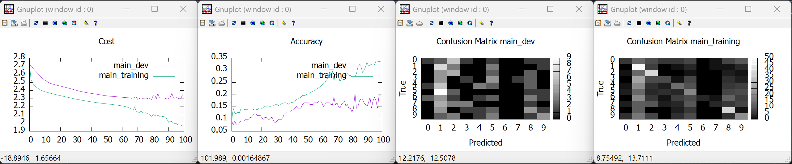
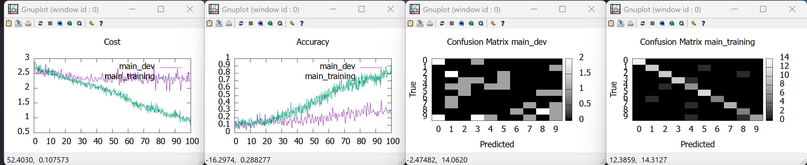
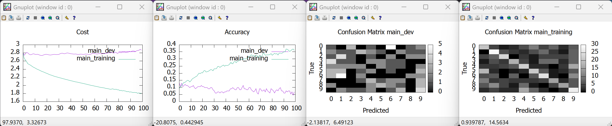
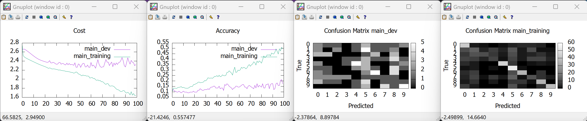
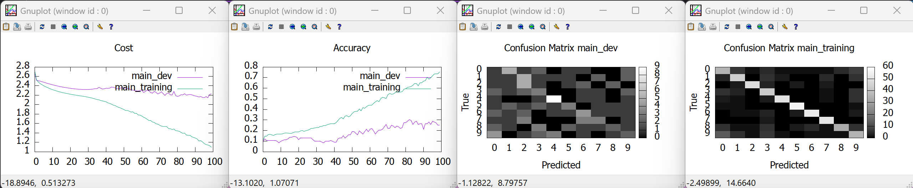
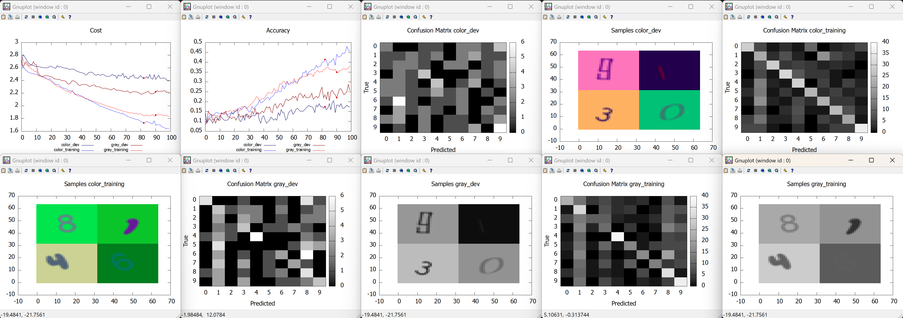
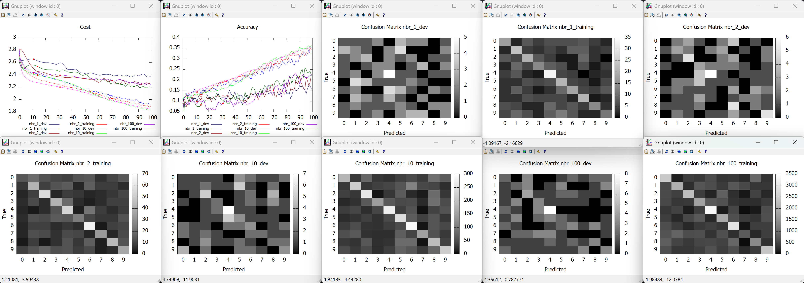
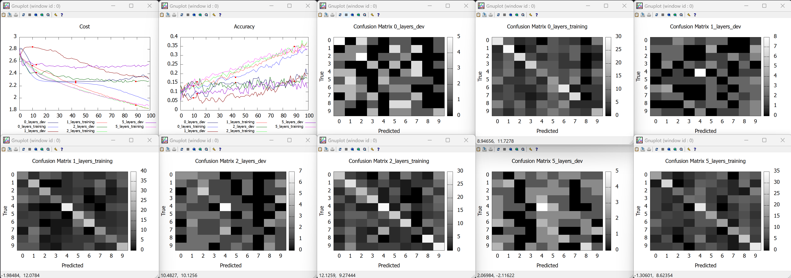

# N layer model on numbers dataset

## Table of Contents

- [Observations without regularization](#observations-without-regularization)
- [Effects of hyper parameters changes](#effects-of-hyper-parameters-changes)
  - [Data preparation hyper parameters](#data-preparation-hyper-parameters)
  - [Data stochastic augmentation hyper parameters](#data-stochastic-augmentation-hyper-parameters)
  - [Model hyper parameters](#model-hyper-parameters)
  - [Regularization hyper parameters](#regularization-hyper-parameters)
- [Regularization](#regularization)

```bash
bundle exec ruby ./bin/train --dataset=numbers --data-loader=NumoImageMagick --accuracy=ClassesNumo --model=NLayers --optimizer=Adam
```

## Observations without regularization

* [A] We see that just adding the BatchNormalization layer allows the Adam optimizer to be less noisy (cost function is decreasing globally without big bounces) and more quickly converge till epoch 65. Afterwards we see more noise in the progression, with the dev dataset stagnating around 15% accuracy (high variance) while training increases till 33% at epoch 100. Those figures were obtained without adding any hidden layer (`--layers=`) in the model. It seems the model overfits some data and can't learn much anyway.


* [B] We see that using minibatches (adding `--max-minibatch-size=100`) on top of [A], the convergence is more noisy but accuracy gets high faster (30% was reached around epoch 35 instead of epoch 65 with just 1 minibatch). Final accuracy at epoch 100 is around 85% (much higher than whithout minibatches) but variance is still very high with dev accuracy staying around 32%. Intuition is that accuracy is increasing faster as each epoch will learn 5 times more than with 1 minibatch. Variance is also a bit better as using minibatches is a form of regularization.


* [C] Adding to [A] 1 hidden layer of 100 units with leaky ReLU activation makes accuracy go up faster (30% reached around epoch 45 instead of epoch 80), and makes learning more stable (less spikes in cost and accuracy even after epoch 70). Performance is much better, with end accuracy around 73%, but variance is still high, with dev accuracy around 31% (still much better than the 15% reached without this hidden layer). Intuition is that this proves the net needed more units to be able to better learn.


* [D] Removing from [C] the BatchNormalization layers between the dense and leaky ReLU hidden layers makes accuracy goes up much slower and in a much more noisy way.


* [E] Replacing in [C] 1 hidden layer of 100 units with 10 hidden layers of 10 units each (using `--layers=10,10,10,10,10,10,10,10,10,10`) gives really bad results. Accuracy is increasing more slowly (reaching 35%) while variance is much worse (dev accuracy lowering towards 6%). It seems that increasing layers without adding units favors overfitting.


* [F] Using 3 hidden layers of 400, 200 and 100 units respectively (using `--layers=400,200,100`) makes accuracy increase much faster (95% at epoch 50, getting and staying at 100% after epoch 75), but keeps a very high variance (stagnating from epoch 15 around 15%). This means the model needed even more units and layers to learn better, but is now highly overfitting. Regularization is needed from here.


* [G] Replacing leaky ReLU with tanh activation from [C] seems to increase accuracy slower than [C] (47% reached at epoch 100 compared to 73%), while increasing variance (dev accuracy around 15% compared to 31%). Also performance is much more noisy than with leaky ReLU.


* [H] Changing tanh activation with sigmoid from [G] got very similar results as with tanh, with the noisy behaviour starting a bit earlier (from epoch 20 compared to 40 with tanh).


* [I] Changing leaky ReLu with ReLU from [C] got very similar results than [C]. Variance seems to be a bit bigger, and accuracy a bit higher.


* When adding visualizations of the hidden layer units (for example using `--track-layer=L0_Dense_W,10 --track-layer=L4_Dense_W,10` from [C]), we see during training that only the first layer evolves a lot, the remaining dense ones stay very close to their initial values. This also confirms the tendency that adding more layers does not make the network learn faster, however adding more units on the first layer increases accuracy while creating variance.


## Effects of hyper parameters changes

### Data preparation hyper parameters

* Applying grayscale: `--exp-id=color --resize=32,32 --dataset=numbers --data-loader=NumoImageMagick --accuracy=ClassesNumo --model=NLayers --optimizer=Adam --gradient-checks=off --nbr-epochs=100 --max-minibatch-size=50000 --layers=10 --display-samples=4 --experiment --exp-id=gray --grayscale=true --resize=32,32 --dataset=numbers --data-loader=NumoImageMagick --accuracy=ClassesNumo --model=NLayers --optimizer=Adam --gradient-checks=off --nbr-epochs=100 --max-minibatch-size=50000 --layers=10 --display-samples=4`

| Color space | # parameters | Params/samples ratio | Training cost | Training accuracy | Dev cost | Dev accuracy | Early stop epoch | Avoidable bias | Variance |
| ----------- | ------------ | -------------------- | ------------- | ----------------- | -------- | ------------ | ---------------- | -------------- | -------- |
| Color       | 30860        | 52                   | 1.64          | 46%               | 2.39     | 17%          | 82               | 29%            | 28%      |
| Grayscale   | 10380        | 17.5                 | 1.83          | 38%               | 2.21     | 26%          | 90               | 12%            | 12%      |



Analysis: There is a smaller variance when using grayscale. The model is focusing more on the number shapes rather than on the colors.

* Applying min-max normalization: `--exp-id=no_norm --resize=32,32 --dataset=numbers --data-loader=NumoImageMagick --accuracy=ClassesNumo --model=NLayers --optimizer=Adam --gradient-checks=off --nbr-epochs=100 --max-minibatch-size=50000 --layers=10 --display-samples=4 --experiment --exp-id=minmax_norm --minmax-normalize=true --resize=32,32 --dataset=numbers --data-loader=NumoImageMagick --accuracy=ClassesNumo --model=NLayers --optimizer=Adam --gradient-checks=off --nbr-epochs=100 --max-minibatch-size=50000 --layers=10 --display-samples=4`

| Min-max normalization | Training cost | Training accuracy | Dev cost | Dev accuracy | Early stop epoch | Avoidable bias | Variance |
| --------------------- | ------------- | ----------------- | -------- | ------------ | ---------------- | -------------- | -------- |
| Off                   | 1.64          | 46%               | 2.39     | 17%          | 82               | 29%            | 29%      |
| On                    | 1.15          | 75%               | 2.19     | 30%          | 73               | 45%            | 45%      |


Analysis: We see that the model is learning in a faster way using minmax normalization. However the learning slopes seem similar, indicating that the variance is not really affected by it.

* Applying adaptive invert: `--exp-id=no_invert --minmax-normalize=true --grayscale=true --resize=32,32 --dataset=numbers --data-loader=NumoImageMagick --accuracy=ClassesNumo --model=NLayers --optimizer=Adam --gradient-checks=off --nbr-epochs=100 --max-minibatch-size=50000 --layers=10 --display-samples=4 --experiment --exp-id=invert --adaptive-invert=true --minmax-normalize=true --grayscale=true --resize=32,32 --dataset=numbers --data-loader=NumoImageMagick --accuracy=ClassesNumo --model=NLayers --optimizer=Adam --gradient-checks=off --nbr-epochs=100 --max-minibatch-size=50000 --layers=10 --display-samples=4`

| Adaptive invert | Training cost | Training accuracy | Dev cost | Dev accuracy | Early stop epoch | Avoidable bias | Variance |
| --------------- | ------------- | ----------------- | -------- | ------------ | ---------------- | -------------- | -------- |
| Off             | 1.25          | 70%               | 1.87     | 44%          |                  | 30%            | 26%      |
| On              | 0.99          | 82%               | 1.53     | 56%          |                  | 18%            | 26%      |


Analysis: The model learns faster and with less noise when using adaptive invert. The variance is not affected.

* Trimming images: `--exp-id=no_trim --resize=32,32 --dataset=numbers --data-loader=NumoImageMagick --accuracy=ClassesNumo --model=NLayers --optimizer=Adam --gradient-checks=off --nbr-epochs=100 --max-minibatch-size=50000 --layers=10 --display-samples=4 --experiment --exp-id=trim --trim=true --resize=32,32 --dataset=numbers --data-loader=NumoImageMagick --accuracy=ClassesNumo --model=NLayers --optimizer=Adam --gradient-checks=off --nbr-epochs=100 --max-minibatch-size=50000 --layers=10 --display-samples=4`

| Trim | Training cost | Training accuracy | Dev cost | Dev accuracy | Early stop epoch | Avoidable bias | Variance |
| ---- | ------------- | ----------------- | -------- | ------------ | ---------------- | -------------- | -------- |
| Off  | 1.64          | 46%               | 2.39     | 17%          | 82               | 54%            | 29%      |
| On   | 0.88          | 87%               | 1.68     | 52%          |                  | 13%            | 35%      |


Analysis: We see that the model learns much faster, still keeping the variance.

* Changing input image size: `--exp-id=size_8 --dataset=numbers --data-loader=NumoImageMagick --accuracy=ClassesNumo --model=NLayers --optimizer=Adam --gradient-checks=off --nbr-epochs=100 --max-minibatch-size=50000 --layers=32 --resize=8,8 --experiment --exp-id=size_16 --dataset=numbers --data-loader=NumoImageMagick --accuracy=ClassesNumo --model=NLayers --optimizer=Adam --gradient-checks=off --nbr-epochs=100 --max-minibatch-size=50000 --layers=32 --resize=16,16 --experiment --exp-id=size_32 --dataset=numbers --data-loader=NumoImageMagick --accuracy=ClassesNumo --model=NLayers --optimizer=Adam --gradient-checks=off --nbr-epochs=100 --max-minibatch-size=50000 --layers=32 --resize=32,32 --experiment --exp-id=size_110 --dataset=numbers --data-loader=NumoImageMagick --accuracy=ClassesNumo --model=NLayers --optimizer=Adam --gradient-checks=off --nbr-epochs=100 --max-minibatch-size=50000 --layers=32 --resize=110,110`

| Size | # parameters | Params/samples ratio | Training cost | Training accuracy | Dev cost | Dev accuracy | Early stop epoch | Avoidable bias | Variance |
| ---- | ------------ | -------------------- | ------------- | ----------------- | -------- | ------------ | ---------------- | -------------- | -------- |
| 8    | 6548         | 11                   | 1.91          | 33%               | 2.35     | 18%          | 40               | 67%            | 15%      |
| 16   | 24980        | 42                   | 1.35          | 63%               | 2.29     | 22%          | 22               | 37%            | 41%      |
| 32   | 98708        | 166                  | 1.01          | 80%               | 2.23     | 27%          | 44               | 20%            | 53%      |
| 110  | 1162004      | 1960                 | 1.62          | 48%               | 2.37     | 17%          | 67               | 52%            | 31%      |


Analysis: Using a size between 16 and 32 seems to be a good balance between the model's performance and avoiding too much variance.

### Data stochastic augmentation hyper parameters

* Changing dataset Gaussian noise: `--exp-id=noise_0 --noise-intensity=0 --display-samples=4 --dataset=numbers --data-loader=NumoImageMagick --accuracy=ClassesNumo --model=NLayers --optimizer=Adam --gradient-checks=off --nbr-epochs=100 --max-minibatch-size=50000 --layers=16 --experiment --exp-id=noise_01 --noise-intensity=0.01 --display-samples=4 --dataset=numbers --data-loader=NumoImageMagick --accuracy=ClassesNumo --model=NLayers --optimizer=Adam --gradient-checks=off --nbr-epochs=100 --max-minibatch-size=50000 --layers=16 --experiment --exp-id=noise_1 --noise-intensity=0.1 --display-samples=4 --dataset=numbers --data-loader=NumoImageMagick --accuracy=ClassesNumo --model=NLayers --optimizer=Adam --gradient-checks=off --nbr-epochs=100 --max-minibatch-size=50000 --layers=16 --experiment --exp-id=noise_5 --noise-intensity=0.5 --display-samples=4 --dataset=numbers --data-loader=NumoImageMagick --accuracy=ClassesNumo --model=NLayers --optimizer=Adam --gradient-checks=off --nbr-epochs=100 --max-minibatch-size=50000 --layers=16 --experiment --exp-id=noise_9 --noise-intensity=0.9 --display-samples=4 --dataset=numbers --data-loader=NumoImageMagick --accuracy=ClassesNumo --model=NLayers --optimizer=Adam --gradient-checks=off --nbr-epochs=100 --max-minibatch-size=50000 --layers=16`

| Noise intensity | Training cost | Training accuracy | Dev cost | Dev accuracy | Early stop epoch | Avoidable bias | Variance |
| --------------- | ------------- | ----------------- | -------- | ------------ | ---------------- | -------------- | -------- |
| 0%              | 1.93          | 34%               | 2.37     | 15%          | 97               | 66%            | 19%      |
| 1%              | 1.77          | 41%               | 2.34     | 11%          | 81               | 59%            | 30%      |
| 10%             | 1.70          | 48%               | 2.37     | 19%          | 78               | 52%            | 29%      |
| 50%             | 1.60          | 49%               | 2.33     | 17%          | 10               | 51%            | 32%      |
| 90%             | 1.89          | 32%               | 2.28     | 17%          | 74               | 68%            | 15%      |


Analysis: Adding between 10% and 50% noise gives good results: accuracy is good (around 50%) while keeping variance under control (around 30%). More noise prevents the model from learning, as well as less noise.

* Changing dataset rotations: `--exp-id=rot_0 --rot-angle=0 --display-samples=4 --dataset=numbers --data-loader=NumoImageMagick --accuracy=ClassesNumo --model=NLayers --optimizer=Adam --gradient-checks=off --nbr-epochs=100 --max-minibatch-size=50000 --layers=16 --experiment --exp-id=rot_5 --rot-angle=5 --display-samples=4 --dataset=numbers --data-loader=NumoImageMagick --accuracy=ClassesNumo --model=NLayers --optimizer=Adam --gradient-checks=off --nbr-epochs=100 --max-minibatch-size=50000 --layers=16 --experiment --exp-id=rot_30 --rot-angle=30 --display-samples=4 --dataset=numbers --data-loader=NumoImageMagick --accuracy=ClassesNumo --model=NLayers --optimizer=Adam --gradient-checks=off --nbr-epochs=100 --max-minibatch-size=50000 --layers=16 --experiment --exp-id=rot_90 --rot-angle=90 --display-samples=4 --dataset=numbers --data-loader=NumoImageMagick --accuracy=ClassesNumo --model=NLayers --optimizer=Adam --gradient-checks=off --nbr-epochs=100 --max-minibatch-size=50000 --layers=16 --experiment --exp-id=rot_180 --rot-angle=180 --display-samples=4 --dataset=numbers --data-loader=NumoImageMagick --accuracy=ClassesNumo --model=NLayers --optimizer=Adam --gradient-checks=off --nbr-epochs=100 --max-minibatch-size=50000 --layers=16`

| Rotation | Training cost | Training accuracy | Dev cost | Dev accuracy | Early stop epoch | Avoidable bias | Variance |
| -------- | ------------- | ----------------- | -------- | ------------ | ---------------- | -------------- | -------- |
| 0°       | 1.93          | 33.56%            | 2.37     | 15.15%       | 97               | 66%            | 18%      |
| 5°       | 1.86          | 36.42%            | 2.31     | 14.39%       | 81               | 64%            | 22%      |
| 30°      | 2.19          | 19.56%            | 2.42     | 14.39%       | 84               | 80%            | 5%       |
| 90°      | 2.27          | 19.73%            | 2.56     | 6.82%        | 10               | 80%            | 13%      |
| 180°     | 2.24          | 15.85%            | 2.35     | 8.33%        |                  | 84%            | 8%       |


Analysis: Smaller rotations show decent learning while larger rotations significantly degrade performance.

* Changing number of augmented samples: `--exp-id=nbr_1 --nbr-clones=1 --resize=24,24 --rot-angle=20 --noise-intensity=0.1 --dataset=numbers --data-loader=NumoImageMagick --accuracy=ClassesNumo --model=NLayers --optimizer=Adam --gradient-checks=off --nbr-epochs=100 --max-minibatch-size=100000 --layers=16 --experiment --exp-id=nbr_2 --nbr-clones=2 --resize=24,24 --rot-angle=20 --noise-intensity=0.1 --dataset=numbers --data-loader=NumoImageMagick --accuracy=ClassesNumo --model=NLayers --optimizer=Adam --gradient-checks=off --nbr-epochs=100 --max-minibatch-size=100000 --layers=16 --experiment --exp-id=nbr_10 --nbr-clones=10 --resize=24,24 --rot-angle=20 --noise-intensity=0.1 --dataset=numbers --data-loader=NumoImageMagick --accuracy=ClassesNumo --model=NLayers --optimizer=Adam --gradient-checks=off --nbr-epochs=100 --max-minibatch-size=100000 --layers=16 --experiment --exp-id=nbr_100 --nbr-clones=100 --resize=24,24 --rot-angle=20 --noise-intensity=0.1 --dataset=numbers --data-loader=NumoImageMagick --accuracy=ClassesNumo --model=NLayers --optimizer=Adam --gradient-checks=off --nbr-epochs=100 --max-minibatch-size=100000 --layers=16`

| Samples multiplier | # parameters | Params/samples ratio | Training cost | Training accuracy | Dev cost | Dev accuracy | Early stop epoch | Avoidable bias | Variance |
| ------------------ | ------------ | -------------------- | ------------- | ----------------- | -------- | ------------ | ---------------- | -------------- | -------- |
| 1                  | 27860        | 47                   | 1.91          | 32.38%            | 2.37     | 15.91%       | 11               | 68%            | 16%      |
| 2                  | 27860        | 23                   | 1.89          | 34.32%            | 2.25     | 22.73%       | 70               | 66%            | 12%      |
| 10                 | 27860        | 4.7                  | 1.83          | 36.39%            | 2.20     | 21.97%       | 14               | 64%            | 14%      |
| 100                | 27860        | 0.47                 | 1.84          | 35.68%            | 2.24     | 22.73%       | 31               | 64%            | 13%      |



Analysis: We see a good regularization effect by using data augmentationwith more samples. There seems to have no need for a lot of samples to benfit from it. Around x10 seems to give already best results.

### Model hyper parameters

* Changing number of units in 1 layer: `--exp-id=5_units --dataset=numbers --data-loader=NumoImageMagick --accuracy=ClassesNumo --model=NLayers --optimizer=Adam --gradient-checks=off --nbr-epochs=100 --max-minibatch-size=50000 --layers=5 --experiment --exp-id=10_units --dataset=numbers --data-loader=NumoImageMagick --accuracy=ClassesNumo --model=NLayers --optimizer=Adam --gradient-checks=off --nbr-epochs=100 --max-minibatch-size=50000 --layers=10 --experiment --exp-id=50_units --dataset=numbers --data-loader=NumoImageMagick --accuracy=ClassesNumo --model=NLayers --optimizer=Adam --gradient-checks=off --nbr-epochs=100 --max-minibatch-size=50000 --layers=50 --experiment --exp-id=100_units --dataset=numbers --data-loader=NumoImageMagick --accuracy=ClassesNumo --model=NLayers --optimizer=Adam --gradient-checks=off --nbr-epochs=100 --max-minibatch-size=50000 --layers=100`

| # units | # parameters | Params/samples ratio | Training cost | Training accuracy | Dev cost | Dev accuracy | Early stop epoch | Avoidable bias | Variance |
| ------- | ------------ | -------------------- | ------------- | ----------------- | -------- | ------------ | ---------------- | -------------- | -------- |
| 5       | 181580       | 181                  | 2.27          | 17%               | 2.44     | 15%          |                  | 83%            | 2%       |
| 10      | 363140       | 612                  | 2.10          | 25%               | 2.55     | 9%           | 11               | 75%            | 14%      |
| 50      | 1815620      | 3062                 | 1.53          | 54%               | 2.36     | 17%          | 64               | 46%            | 37%      |
| 100     | 3631220      | 6123                 | 1.10          | 77%               | 2.27     | 23%          | 52               | 23%            | 54%      |


Analysis: Adding units increases accuracy of both training and dev, but also increases variance.

* Changing number of layers: `--exp-id=0_layers --resize=16,16 --dataset=numbers --data-loader=NumoImageMagick --accuracy=ClassesNumo --model=NLayers --optimizer=Adam --gradient-checks=off --nbr-epochs=100 --max-minibatch-size=50000 --layers= --experiment --exp-id=1_layers --resize=16,16 --dataset=numbers --data-loader=NumoImageMagick --accuracy=ClassesNumo --model=NLayers --optimizer=Adam --gradient-checks=off --nbr-epochs=100 --max-minibatch-size=50000 --layers=10 --experiment --exp-id=2_layers --resize=16,16 --dataset=numbers --data-loader=NumoImageMagick --accuracy=ClassesNumo --model=NLayers --optimizer=Adam --gradient-checks=off --nbr-epochs=100 --max-minibatch-size=50000 --layers=10,10 --experiment --exp-id=5_layers --resize=16,16 --dataset=numbers --data-loader=NumoImageMagick --accuracy=ClassesNumo --model=NLayers --optimizer=Adam --gradient-checks=off --nbr-epochs=100 --max-minibatch-size=50000 --layers=10,10,10,10,10`

| # layers | # parameters | Params/samples ratio | Training cost | Training accuracy | Dev cost | Dev accuracy | Early stop epoch | Avoidable bias | Variance |
| -------- | ------------ | -------------------- | ------------- | ----------------- | -------- | ------------ | ---------------- | -------------- | -------- |
| 0        | 7700         | 12.98                | 1.95          | 33%               | 2.32     | 20%          | 43               | 67%            | 13%      |
| 1        | 7820         | 13.19                | 1.83          | 36%               | 2.31     | 19%          | 10               | 64%            | 17%      |
| 2        | 7940         | 13.39                | 1.83          | 37%               | 2.28     | 17%          | 89               | 63%            | 20%      |
| 5        | 8300         | 14                   | 1.87          | 34%               | 2.55     | 12%          | 13               | 66%            | 22%      |



Analysis: We see a normal curve for the 0 layer model, where early stopping correctly detects when overfitting is starting. Having more than 1 layer is not performing: the dev accuracy is plateauing and the model does not learn correctly. The 1 layer model has a big warm-up phase but then seems to steadily learn without increasing variance a lot. The 0-layer or 1-layer models seem to be safe choices.

* Changing minibatch size: `--exp-id=size_50 --dataset=numbers --data-loader=NumoImageMagick --accuracy=ClassesNumo --model=NLayers --optimizer=Adam --gradient-checks=off --nbr-epochs=100 --max-minibatch-size=50 --layers=16 --experiment --exp-id=size_100 --dataset=numbers --data-loader=NumoImageMagick --accuracy=ClassesNumo --model=NLayers --optimizer=Adam --gradient-checks=off --nbr-epochs=100 --max-minibatch-size=100 --layers=16 --experiment --exp-id=size_300 --dataset=numbers --data-loader=NumoImageMagick --accuracy=ClassesNumo --model=NLayers --optimizer=Adam --gradient-checks=off --nbr-epochs=100 --max-minibatch-size=300 --layers=16 --experiment --exp-id=size_1000 --dataset=numbers --data-loader=NumoImageMagick --accuracy=ClassesNumo --model=NLayers --optimizer=Adam --gradient-checks=off --nbr-epochs=100 --max-minibatch-size=1000 --layers=16`

| Size | Training cost | Training accuracy | Dev cost | Dev accuracy | Early stop epoch | Avoidable bias | Variance |
| ---- | ------------- | ----------------- | -------- | ------------ | ---------------- | -------------- | -------- |
| 50   | 0.86          | 78%               | 2.41     | 25%          | 40               | 22%            | 53%      |
| 100  | 0.83          | 84%               | 2.36     | 28%          | 43               | 16%            | 56%      |
| 300  | 1.38          | 64%               | 2.36     | 18%          | 17               | 36%            | 46%      |
| 1000 | 1.92          | 34%               | 2.40     | 14%          | 10               | 66%            | 20%      |


Analysis: Using minibatches clearly helps in making the model learn faster, however the regularization effect is still limited as the variance grows.

* Changing random seed (by executing the same model several times on the same dataset): `--training-times=4 --dataset=numbers --data-loader=NumoImageMagick --accuracy=ClassesNumo --model=NLayers --optimizer=Adam --gradient-checks=off --nbr-epochs=100 --max-minibatch-size=50000 --layers=16`

| # | Training cost | Training accuracy | Dev cost | Dev accuracy | Early stop epoch | Avoidable bias | Variance |
| - | ------------- | ----------------- | -------- | ------------ | ---------------- | -------------- | -------- |
| 1 | 1.93          | 34%               | 2.37     | 15%          | 97               | 66%            | 19%      |
| 2 | 1.77          | 39%               | 2.32     | 17%          | 51               | 61%            | 22%      |
| 3 | 1.94          | 31%               | 2.37     | 14%          |                  | 69%            | 17%      |
| 4 | 1.92          | 34%               | 2.40     | 14%          | 10               | 66%            | 20%      |


Analysis: A few differences can be seen in accuracy (8% range) and variance (5% range). This indicates some sensitivity to the initial random conditions of the model.

* Changing datasets random seed: `--exp-id=exp_1 --dataset-seed=0 --dataset=numbers --data-loader=NumoImageMagick --accuracy=ClassesNumo --model=NLayers --optimizer=Adam --gradient-checks=off --nbr-epochs=100 --max-minibatch-size=50000 --layers=16 --experiment --exp-id=exp_2 --dataset-seed=10 --dataset=numbers --data-loader=NumoImageMagick --accuracy=ClassesNumo --model=NLayers --optimizer=Adam --gradient-checks=off --nbr-epochs=100 --max-minibatch-size=50000 --layers=16 --experiment --exp-id=exp_3 --dataset-seed=20 --dataset=numbers --data-loader=NumoImageMagick --accuracy=ClassesNumo --model=NLayers --optimizer=Adam --gradient-checks=off --nbr-epochs=100 --max-minibatch-size=50000 --layers=16 --experiment --exp-id=exp_4 --dataset-seed=30 --dataset=numbers --data-loader=NumoImageMagick --accuracy=ClassesNumo --model=NLayers --optimizer=Adam --gradient-checks=off --nbr-epochs=100 --max-minibatch-size=50000 --layers=16`

| # | Training cost | Training accuracy | Dev cost | Dev accuracy | Early stop epoch | Avoidable bias | Variance |
| - | ------------- | ----------------- | -------- | ------------ | ---------------- | -------------- | -------- |
| 1 | 1.93          | 34%               | 2.37     | 15%          | 97               | 66%            | 19%      |
| 2 | 1.87          | 35%               | 2.30     | 14%          | 94               | 65%            | 21%      |
| 3 | 2.05          | 25%               | 2.40     | 12%          | 90               | 75%            | 13%      |
| 4 | 1.58          | 52%               | 2.49     | 15%          | 17               | 49%            | 37%      |


Analysis: We see big differences in the accuracy (26% range) and variance (24% range) with different random seeds. This indicates that the model is very sensitive to random initial conditions of the data. This is also giving the intuition that data preparation needs to be improved to reduce this randomness from the data itself.

* Changing Adam learning rate: `--exp-id=lr_0001 --learning-rate=0.0001 --dataset=numbers --data-loader=NumoImageMagick --accuracy=ClassesNumo --model=NLayers --optimizer=Adam --gradient-checks=off --nbr-epochs=100 --max-minibatch-size=50000 --layers=16 --experiment --exp-id=lr_001 --learning-rate=0.001 --dataset=numbers --data-loader=NumoImageMagick --accuracy=ClassesNumo --model=NLayers --optimizer=Adam --gradient-checks=off --nbr-epochs=100 --max-minibatch-size=50000 --layers=16 --experiment --exp-id=lr_002 --learning-rate=0.002 --dataset=numbers --data-loader=NumoImageMagick --accuracy=ClassesNumo --model=NLayers --optimizer=Adam --gradient-checks=off --nbr-epochs=100 --max-minibatch-size=50000 --layers=16 --experiment --exp-id=lr_01 --learning-rate=0.01 --dataset=numbers --data-loader=NumoImageMagick --accuracy=ClassesNumo --model=NLayers --optimizer=Adam --gradient-checks=off --nbr-epochs=100 --max-minibatch-size=50000 --layers=16`

| Learning rate | Training cost | Training accuracy | Dev cost | Dev accuracy | Early stop epoch | Avoidable bias | Variance |
| ------------- | ------------- | ----------------- | -------- | ------------ | ---------------- | -------------- | -------- |
| 1e-4          | 1.38          | 66%               | 2.40     | 23%          | 28               | 34%            | 43%      |
| 1e-3          | 1.77          | 39%               | 2.32     | 17%          | 51               | 61%            | 22%      |
| 2e-3          | 2.14          | 23%               | 2.33     | 14%          | 99               | 77%            | 9%       |
| 1e-2          | 2.14          | 21%               | 2.42     | 10%          | 45               | 79%            | 11%      |


Analysis: The smaller learning rate is, the more overfitting we get and the faster learning is happening. If we use a small learning rate, we have to also work on regularaization at the same time.

* Changing optimizers: `--exp-id=adam --dataset=numbers --data-loader=NumoImageMagick --accuracy=ClassesNumo --model=NLayers --optimizer=Adam --gradient-checks=off --nbr-epochs=100 --max-minibatch-size=50000 --layers=16 --experiment --exp-id=constant --dataset=numbers --data-loader=NumoImageMagick --accuracy=ClassesNumo --model=NLayers --optimizer=Constant --gradient-checks=off --nbr-epochs=100 --max-minibatch-size=50000 --layers=16 --experiment --exp-id=exp_decay --dataset=numbers --data-loader=NumoImageMagick --accuracy=ClassesNumo --model=NLayers --optimizer=ExponentialDecay --gradient-checks=off --nbr-epochs=100 --max-minibatch-size=50000 --layers=16`

| Optimizer         | Training cost | Training accuracy | Dev cost | Dev accuracy | Early stop epoch | Avoidable bias | Variance |
| ----------------- | ------------- | ----------------- | -------- | ------------ | ---------------- | -------------- | -------- |
| Adam              | 1.93          | 34%               | 2.37     | 15%          | 97               | 66%            | 19%      |
| Constant          | 2.06          | 27%               | 2.46     | 20%          | 50               | 73%            | 7%       |
| Exponential decay | 2.61          | 11%               | 2.67     | 8%           | 46               | 89%            | 3%       |


Analysis: Exponential decay is a bad choice, as it plateaus very quickly. Constant has good results, but ultimately Adam beats them all with a lot of epochs.

### Regularization hyper parameters

* Changing dropout: `--exp-id=drop_0 --dropout-rate=0 --resize=32,32 --dataset=numbers --data-loader=NumoImageMagick --accuracy=ClassesNumo --model=NLayers --optimizer=Adam --gradient-checks=off --nbr-epochs=100 --max-minibatch-size=50000 --layers=16 --experiment --exp-id=drop_10 --dropout-rate=0.1 --resize=32,32 --dataset=numbers --data-loader=NumoImageMagick --accuracy=ClassesNumo --model=NLayers --optimizer=Adam --gradient-checks=off --nbr-epochs=100 --max-minibatch-size=50000 --layers=16 --experiment --exp-id=drop_50 --dropout-rate=0.5 --resize=32,32 --dataset=numbers --data-loader=NumoImageMagick --accuracy=ClassesNumo --model=NLayers --optimizer=Adam --gradient-checks=off --nbr-epochs=100 --max-minibatch-size=50000 --layers=16 --experiment --exp-id=drop_80 --dropout-rate=0.8 --resize=32,32 --dataset=numbers --data-loader=NumoImageMagick --accuracy=ClassesNumo --model=NLayers --optimizer=Adam --gradient-checks=off --nbr-epochs=100 --max-minibatch-size=50000 --layers=16`

| Dropout rate | Training cost | Training accuracy | Dev cost | Dev accuracy | Early stop epoch | Avoidable bias | Variance |
| ------------ | ------------- | ----------------- | -------- | ------------ | ---------------- | -------------- | -------- |
| 0%           | 1.45          | 60%               | 2.41     | 17%          | 10               | 40%            | 43%      |
| 10%          | 1.70          | 43%               | 2.29     | 23%          | 62               | 57%            | 20%      |
| 50%          | 2.47          | 11%               | 2.49     | 12%          | 23               | 89%            | -1%      |
| 80%          | 2.47          | 11%               | 2.55     | 13%          | 20               | 89%            | -2%      |


Analysis: We see a clear regularization improvement when using 10% dropout, while not impacting accuracy too much. However more dropout rate prevents the model to learn properly. Less dropout rate does not prevent overfitting enough.

* Changing weight decay: `--exp-id=wd_0 --weight-decay=0 --resize=32,32 --dataset=numbers --data-loader=NumoImageMagick --accuracy=ClassesNumo --model=NLayers --optimizer=Adam --gradient-checks=off --nbr-epochs=100 --max-minibatch-size=50000 --layers=16 --experiment --exp-id=wd_0001 --weight-decay=0.0001 --resize=32,32 --dataset=numbers --data-loader=NumoImageMagick --accuracy=ClassesNumo --model=NLayers --optimizer=Adam --gradient-checks=off --nbr-epochs=100 --max-minibatch-size=50000 --layers=16 --experiment --exp-id=wd_001 --weight-decay=0.001 --resize=32,32 --dataset=numbers --data-loader=NumoImageMagick --accuracy=ClassesNumo --model=NLayers --optimizer=Adam --gradient-checks=off --nbr-epochs=100 --max-minibatch-size=50000 --layers=16 --experiment --exp-id=wd_01 --weight-decay=0.01 --resize=32,32 --dataset=numbers --data-loader=NumoImageMagick --accuracy=ClassesNumo --model=NLayers --optimizer=Adam --gradient-checks=off --nbr-epochs=100 --max-minibatch-size=50000 --layers=16 --experiment --exp-id=wd_1 --weight-decay=0.1 --resize=32,32 --dataset=numbers --data-loader=NumoImageMagick --accuracy=ClassesNumo --model=NLayers --optimizer=Adam --gradient-checks=off --nbr-epochs=100 --max-minibatch-size=50000 --layers=16`

| Weight decay | Training cost | Training accuracy | Dev cost | Dev accuracy | Early stop epoch | Avoidable bias | Variance |
| ------------ | ------------- | ----------------- | -------- | ------------ | ---------------- | -------------- | -------- |
| 0            | 1.45          | 60%               | 2.41     | 17%          | 10               | 40%            | 43%      |
| 1e-4         | 1.33          | 64%               | 2.36     | 22%          | 58               | 36%            | 42%      |
| 1e-3         | 1.51          | 58%               | 2.31     | 23%          | 39               | 42%            | 35%      |
| 1e-2         | 1.86          | 55%               | 2.64     | 25%          | 82               | 45%            | 30%      |
| 1e-1         | 5.08          | 68%               | 6.11     | 25%          | 19               | 32%            | 43%      |


Analysis: Regularization effect of weights decay seems limited. Best value seems to be around 1e-2, but that is far from enough to prevent overfitting.

## Regularization

* When trying various regularization techniques from [C] (`--nbr-clones=3 --rot-angle=30 --dropout-rate=0.02`), we observe that the model is always overfitting. This gives the intuition that the model is too complex for the problem at hand.
* The Parameter-to-sample ratio rule can help estimating the desired complexity of the model. nbr_parameters / nbr_training_samples should be between 0.1 and 10. With the experiment [C], we have this ratio = (36300 * 100 + 100 + 100 + 100 * 10 + 10 + 10) / 593 = 6123. Clearly the model is far too complex.
* On experiment [J] we reduce the complexity of the model with 1 layer of 10 units and we downsample the images from 110 x 110 down to 32 x 32. We use data augmentation with 52 clones, still in 1 minibatch. This brings the ratio down to 1.0. Parameters used are `--nbr-epochs=100 --early-stopping-patience=10 --max-minibatch-size=50000 --layers=10 --nbr-clones=52 --rot-angle=10 --resize=32,32 --noise-intensity=0.02 --display-samples=4`. Resulting accuracies at epoch 100 are 44% for training and 24% for dev. We see that now more epochs are needed to train properly, and the dev accuracy is steadily decreasing. It looks like the warm-up phase of the training is visible: dev cost starts to decrease and dev accuracy starts to increase steadily only after epoch 25.


* As seen in various hyper parameters comparisons, data preparation and optimization seems to provide bigger impacts for accuracy and variance.
* Experiment [K] adds a lot of data preparation and removes any regularization as the training accuracy starts being below the dev one (negative variance) when using regularization and data augmentation: `--dataset=numbers --data-loader=NumoImageMagick --accuracy=ClassesNumo --model=NLayers --optimizer=Adam --gradient-checks=off --grayscale=true --minmax-normalize=true --adaptive-invert=true --trim=true --resize=16,16 --noise-intensity=0 --rot-angle=0 --nbr-clones=1 --layers=16 --max-minibatch-size=100000 --learning-rate=1e-2 --dropout=0 --weight-decay=0.00 --display-samples=4 --track-layer=L0_Dense_W,8`. The bigger input size width and the bigger variance will get. With this experiment we reach nearly 100% of occuracy with nearly 0% variance.


